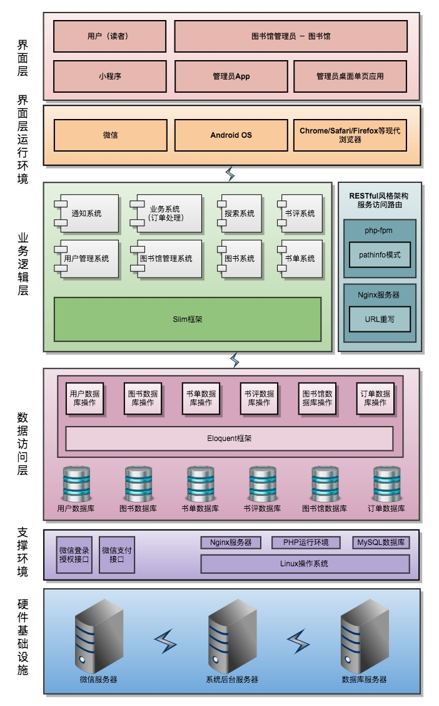

# 后端
::: tip 
Slim 文档：[点击查看](http://slim.lup5.com/docs/)  
Eloquent 文档：[点击查看](http://laravelacademy.org/post/8194.html)
:::

## 系统架构

本项目采用三层架构，从上至下分为界面层、业务逻辑层(`Controller`)、数据访问层(`Eloquent\Model`)。通过 Slim 框架完全实现**前后端分离**，前后端通过`HTTPS`协议进行通信，传输数据格式为`JSON`。业务逻辑层提供了[RESTful风格的API](./api.md)。

**系统架构图**：


## 安全机制
本项目采用`JWT`实现权限控制。用户权限验证流程如下：

1. 用户使用用户名密码请求服务器，服务器进行验证用户的信息，通过验证后返回给用户一个 token，失败时返回401错误
2. token 中携带了`user_type`，`user_id`等信息，设定了过期时间
3. 客户端存储 token，之后访问每一个 API 时必须在`header`中添加`TOKEN`字段
4. 服务器获得 token，检验是否合法；然后获取其中携带的用户信息，判断该用户是否有操作权限
5. 若有操作权限，执行请求并返回数据；若 token 不合法或无操作权限，返回 403 错误


## 数据库与模型类
### 命名规范
数据表命名遵守`Eloquent`默认命名规范：

* 实体表：`Model`名（小写下划线，下同）的复数形式，如`wechat_users`, `books`, `booklists`，`libraries`等
* 关系表：`Model`名按首字母顺序用下划线连接，如`book_booklist`，`booklist_user`等
* 外键名：`Model`名+下划线+`id`，如`book_id`，`library_id`等

::: tip
如果不确定`Eloquent`的默认表名是什么，可以使用以下语句获取：

```PHP
str_plural('mouse'); // Mouse类对应的表名为mice
```
:::

### 数据表
| 表名 | 描述 |
| --- | --- |
| books | 图书信息 |
| booklists | 书单信息 |
| book_booklist | 书单内图书条目 |
| booklist_wechat_user | 书单-用户收藏关系 |
| codes | 验证码 |
| classifications | 中图法分类号 |
| libraries | 图书馆信息 |
| orders | 订单信息 |
| reviews | 图书评论 |
| review_likes | 评论点赞 |
| tokens | token信息 |
| wechat_users | 微信小程序用户信息 |

### 表字段

* 创建时间、更新时间：`created_at`、`updated_at`
* 删除时间：`deleted_at`，默认`null`（见[软删除](http://laravelacademy.org/post/1020.html))

数据库表结构与数据`.sql`文件见[github](https://github.com/imageslr/library-api/tree/master/db/)，导入方式见[创建数据库](./install.md#创建数据库)。

## 参数校验

### AOP
Slim 框架提供了中间件功能，可以在 Controller 之前和之后运行代码。**当中间件内抛出异常时，后续代码将不再执行，未捕获的异常将转入错误处理器；只有显式调用`$next($request, $response)`时才会执行后续代码**。这就是参数校验和权限控制的原理。

这样做的好处是**关注点分离**，Controller 中的方法将只关注业务逻辑，其余操作以中间件的形式添加到应用程序中。

### 实现方法
本项目使用[ Respect\Validation ](http://respect.github.io/Validation/)校验参数，其优点是使用简单，定制性高。  
在[定义一个路由](https://github.com/imageslr/library-api/tree/master/bootstrap/routes/modules/)的同时，为其添加**参数校验中间件**。以发表评论接口`POST /reviews`为例：

```PHP
$this->post('/reviews', 'ReviewController:addReviewByBookId')
  ->add(function ($request, $response, $next) {
      $reviewInfo = $request->getParsedBody(); // 获取参数对象
      v::arrayType()->keySet( 
          v::key('wechat_user_id', v::intVal()), // uid 必须为整数
          v::key('score', v::intVal()->between(1, 10)), // 评分介于 1 ~ 10
          v::key('content', v::stringType()->notEmpty()->length(1, 200)) // 评论内容不能为空，最多 200 个字符
      )->setName('info')->check($reviewInfo);
      return $next($request, $response);
  });
```

`add(...)`作用是为该 API 添加一个校验参数中间件，`v::arrayType->...->setName()`定义参数格式及参数名称，`check()`开始校验。当校验失败时，`check()`会抛出一个`ValidationException`异常，并附带错误信息，说明没有通过校验的参数名及期望的格式，见[错误处理](#错误处理)。


## 权限控制
各个接口的权限控制主要有以下三种情况：

* 只有登录后才能访问，如创建书单、发表书评
* 只允许特定类型用户访问，如只有超级管理员能获取所有用户信息
* 只有对应用户有操作权限，如修改用户信息`POST /users/{id}`，需要检验`token`中的`user_id`

同参数校验一样，在定义路由的同时为其添加**权限控制中间件**，各中间件定义在[ Auth 类](https://github.com/imageslr/library-api/tree/master/app/Middlewares/Auth.php)中，使用方法如下：

```PHP
// 必须登录
$this->post('/reviews', 'ReviewController:addReviewByBookId')
  ->add(Auth::validate()); 

// 只能是小程序用户
$this->post('/reviews', 'ReviewController:addReviewByBookId')
  ->add(Auth::wechatType()); 

// 只能是超级管理员
$this->get('/users', 'WechatUserController:getUsers')
  ->add(Auth::adminType()); 

// 可以是小程序用户或超级管理员
$this->post('/users', 'WechatUserController:createUser')
  ->add(Auth::multipleType(['wechat', 'admin'])); 

// token 中的 user_id 与 path 中的 id 必须相同
use App\Authorization\Authorization;
use App\Exceptions\AuthorizationException;
$this->post('/users/{id}', 'WechatUserController:createUser')
  ->add(function ($request, $response, $next) {
      $uidFromToken = Authorization::getUserIdFromRequest($request);
      $uidInPath = $request->getAttributes()['id']
      if($uidFromToken != $uidInPath) {
        throw AuthorizationException::denied();
      }
      return $next($request, $response);
  });
```


## 错误处理
Slim 框架提供了全局的错误处理器用于接收所有未捕获的 PHP 异常。在 [API](api.md#错误对象) 中提到过：所有错误情况**一定会**返回一个错误对象。因此，本项目定义了若干个异常类，用于封装错误代码`code`和错误消息`message`、`err_msg`。在[ error_handlers.php ](https://github.com/imageslr/library-api/tree/master/bootstrap/error_handlers.php)中定义了多种错误处理器，用于捕获错误，返回错误对象。

### 示例代码
下面的代码捕获`Respect\Validation`抛出的参数异常错误，返回 400 状态码与错误对象，错误对象中附带明确的错误说明信息：

```PHP
// Validator 参数校验错误
if ($exception instanceof ValidationException) {
    return $c['response']
        ->withStatus(400)
        ->withJson(new BadRequestException(
          INVALID_PARAM, 
          $exception->getMessage()
        ));
}
```

### 示例错误对象
以获取验证码接口`POST /codes`为例。该接口参数必须包含手机号`phone`。现在请求该接口，不附加任何参数，得到的服务器响应如下：

```JSON
{
    "code": 400,
    "message": "参数校验错误",
    "err_msg": "phone 必须是一个11位中国大陆手机号"
}
```
这个错误对象就是由上面示例代码中的`ValidationException`错误处理器返回的。

## 文件结构
[在 GitHub 上查看](https://github.com/imageslr/library-api)

```
.
├── app                   // 主目录
│   ├── Authorization     // 登录授权
│   ├── Controllers       // 业务逻辑控制器
│   ├── Exceptions        // 异常封装
│   ├── Helpers           
│   │   └── Message.php   // 短信发送
│   ├── Middlewares       // 中间件
│   │   ├── Auth.php      // 校验token
│   │   └── validateStartAndCount.php // 校验query中的start与count
│   ├── Models            // 模型类
│   ├── Validators        // Respect\Validation校验类
│   └── error_message.php // 错误信息文本定义
├── bootstrap             // 应用配置
│   ├── configuration.php // 配置项
│   ├── dependencies.php  // 数据库依赖
│   ├── error_handlers.php// 错误处理器
│   └── routes            // 路由配置
│       ├── index.php     
│       └── modules       // 各个模块下的路由
├── composer.json
├── composer.lock
├── vendor                // 依赖库
├── db                    // 数据库文件
│   ├── library_scheme.sql// 所有数据表结构
│   ├── library_data.sql  // 所有数据表数据
    └── ...               // 单个数据表的结构+数据
└── public
    └── index.php         // 入口文件
```