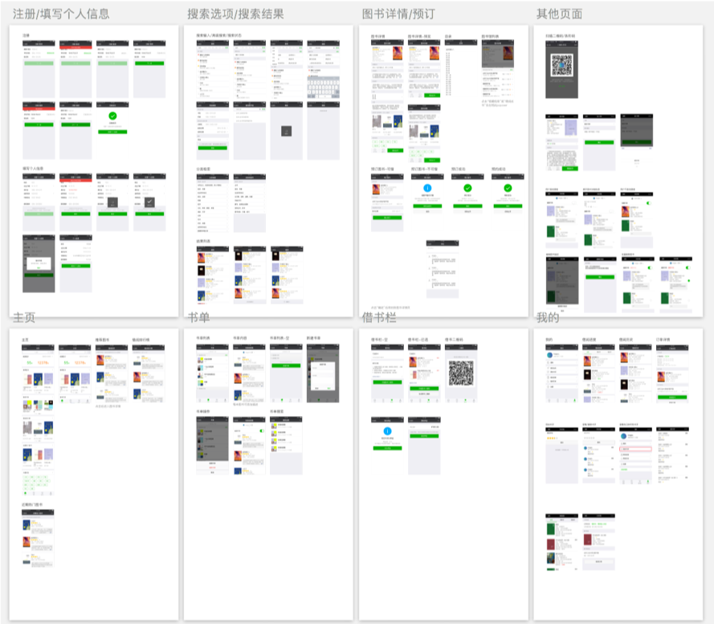
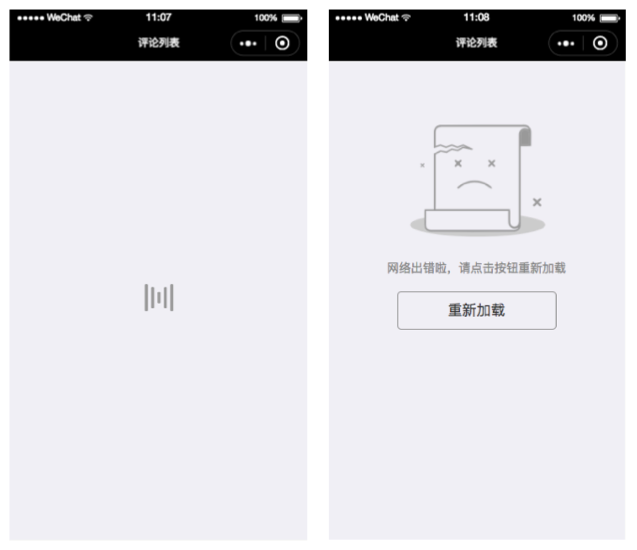

# 前端
:::warning 注意
本页面为 **“在线借书平台”小程序** 开发文档。
:::

:::tip
桌面应用：`webpack`+`vue`+`vuex`+`vue-router`+`ElementUI`，标准前端开发工作流。  

架构图：  


**桌面应用尚未开源。**
:::
## UI
利用原型工具 Sketch 与 WeUI 设计工具包，设计了完整的界面原型。遵守 WeUI 视觉规范，对字体大小、列表间距、颜色方案等做了清晰的约定。[点击查看](./feature.md#运行截图)更多运行截图，<a :href="$withBase('/ui.sketch')">点此下载</a>小程序设计稿。



## 技术栈
基础库`1.9.0`以上，尽可能实现[组件化](#组件文档)

### Mock 数据
本项目采用前后端分离开发。前端采用[Easy Mock](https://www.easy-mock.com/project/5aacc9a1d3f6bd35dfb4be65)作为 Mock 数据服务器，利用`Mock.js`生成模拟数据。Easy Mock 是一个纯前端可视化，并且能快速生成模拟数据的持久化服务，可以结合 Swagger 自动生成 API 定义，集成了`Mock.js`。  


## Promise 支持
部分操作系统下的小程序不支持`Promise`，因此需要引入第三方库。由于小程序不支持 dom，因此不能用`bluebird.js`，只能用`es6-promise.js`。
### API Promise化
小程序 API 都是以回调函数的形式提供。为了提高代码可读性，采用以下方法将小程序原始 API 封装成支持 `Promise` 的 API：

```JS
// utils/promisify.js
function Promisify (fn) {
  return function (obj = {}) {
    return new Promise((resolve, reject) => {
      obj.success = function (res) {
        resolve(res)
      }
      obj.fail = function (res) {
        reject(res)
      }
      fn(obj)
    })
  }
}
```

使用方法：

```JS
import Promisify from 'utils/promisify'
Promisify(wx.scan)({
  type: 'bar'
}).then(res => {
  console.log(res)
}).catch(err => console.error(err))
```
### 添加`.finally()`方法
见[promise-polyfill.js](https://github.com/imageslr/weapp-library/tree/master/utils/promise-polyfill.js)。具体方法如下：

```JS
// 1. 在 /utils/promise-polyfill.js 内引入 Promise 对象
var Promise = require('./es6-promise.js')

// 2. 在 app.js 依次引入 es6-promise，promise-polyfill
import Promise from './utils/es6-promise'
import promisePolyfill from './utils/promise-polyfill'
```

## 网络请求
为了方便管理和维护，小程序项目根据[API 文档定义](https://app.swaggerhub.com/apis/imageslr/weapp/1.0.1#/)，按照`Model`维度，将小程序的网络请求划分为 9 个模块，共 50 余个接口，见[GitHub](https://github.com/imageslr/weapp-library/tree/master/apis/)。

### request 基类方法
小程序项目在[request.js](https://github.com/imageslr/weapp-library/tree/master/apis/request.js)中封装了`request`方法，提供`request拦截`、`responee拦截`、`统一的错误处理`、`BASE_URL设置`等功能，返回`Promise`对象，代码如下：

```JS {2,23,28-32}
// 远程服务器
export const BASE_URL = 'https://www.library-online.cn/api/public/index.php/api'
// 本地服务器
// export const BASE_URL = 'http://localhost:8080/library/public/index.php/api'

/**
 * request 基类方法
 * 状态码 ≥ 400 时，返回 rejected 状态的 promise
 * @param method 请求方式 必填
 * @param relativeUrl 相对路径 必填
 * @param param 参数 可选
 * @param header 请求头参数 可选
 * @returns {Promise} 返回响应完整内容
 */
export function request (method, relativeUrl, param, header) {
  let response, error
  return new Promise((resolve, reject) => {
    wx.request({
      url: BASE_URL + relativeUrl,
      method: method,
      header: Object.assign({
        'Content-Type': 'application/json',
        'TOKEN': getToken() // 添加用户token
      }, header),
      data: param || {},
      success (res) {
        response = res.data
        if (res.statusCode < 400) {
          resolve(res)
        } else {
          reject(res)
        }
      },
      fail (err) {
        error = err
        reject(err)
      },
      complete () {
        // 这里打印请求结果
      }
    })
  })
}
```

本项目的开发环境部署在本地，生产环境部署在腾讯云，测试数据来自 Easy Mock。为方便调试，设置`BASE_URL`变量，这样只需要切换注释就可以方便地更改 API 基址，见上面代码第 2 行（第一处高亮）。

在之前的文档中提到过：客户端存储 token，之后访问每一个 API 时必须在`header`中添加`TOKEN`字段（见[后端-安全机制](./back.md#安全机制)），因此第 23 行（第二处高亮）在**每个请求**的`header`中添加了`TOKEN`字段。  

`wx.request`方法只要得到服务器响应，无论服务器的状态码是多少，都会走`success`回调，因此第 28-32 行（第三处高亮）判断服务器返回的状态码，当状态码大于`400`时，返回`Promise.reject()`。

### requestWithModal 方法
每次请求失败时，以模态框的形式显示错误信息，见[出错处理](#出错处理)。

### get / post / del 方法
在[ requestWithModal ](#显示错误信息)方法的基础上封装了`get`、`post`、`del`方法，每次发起请求都不需要单独写`catch()`语句，请求失败时会自动显示错误信息。


## 出错处理
### 显示错误信息
在之前的文档中提到过：当 API 响应错误时，服务器会返回错误状态码( > 400)以及一个错误对象（见[API-错误对象](./api.md#错误对象))，其中包含给用户看的错误信息`message`。

本项目小程序将`request`进一步封装为`requestWithModal`方法，每次请求失败时，在`catch()`方法中以模态框的形式告知用户发生了什么错误，代码如下：

```JS {8-15}
/**
 * 请求失败时，显示服务器的错误信息(data.message)或微信的错误信息(errMsg)
 */
export function requestWithModal (method, relativeUrl, param, header) {
  return request(method, relativeUrl, param, header)
    .catch((res) => {
      let errMsg
      if (res.statusCode == 403) {
        showLoginModal()
      } else {
        if (res.data && res.data.message) {
          errMsg = res.data.message
        } else {
          errMsg = res.statusCode ? '发生未知错误，请联系开发者' : res.errMsg
        }
        wx.showModal({
          content: errMsg,
          showCancel: false
        })
      }
      return Promise.reject(res)
    })
}
```

其中第 8-15 行的作用是：

1. 当服务器返回`403`状态码时，显示模态框引导用户登录（第8-10行）
2. 当服务器返回错误对象时，`res.data`属性中会有`message`属性，显示该错误信息（第11-13行）
3. 当得到服务器响应，但服务器没有附带错误信息`message`时，显示`发生未知错误，请联系开发者`（第 14 行前半句）
4. 当没有得到服务器响应时，比如没信号或者加载时间过长，显示小程序框架返回的错误信息`errMsg`（第 14 行后半句）

### 页面重新加载
本项目使用[页面加载器](https://github.com/imageslr/weapp-library/tree/master/templates/page-status-indicator/index.wxml#L37-L54)模板表示页面加载状态：




使用方法如下：

1. 在页面`wxml`中引入模板

```HTML
<import src="/templates/page-status-indicator/index" />
<template data="{{pageStatus}}" is="page-status-indicator"></template>
<block wx:if="{{pageStatus == 'done'}}">
  <!-- 这里是页面所有内容 -->
</block>
```

2. 在页面`js`中声明`pageStatus`属性与`onPageReload`方法
3. 在加载数据的方法中设置`pageStatus`属性

```JS {9,18-21,24-28}
Page({
  data: {
    /**
     * 页面状态
     * loading：加载中
     * error：获取数据失败，显示重新加载按钮
     * done：成功，显示页面内容
     */
    pageStatus: 'loading',
    // 其他数据
  },

  // 加载页面
  onLoad: function (options) {
    this._loadPage()
  },

  // 重新加载页面
  onReloadPage: function () {
    this._loadPage()
  },

  _loadPage: function () {
    getBook().then(res => {
      this.setData({pageStatus: 'done'})
    }).catch(() => {
      this.setData({pageStatus: 'error'})
    })
  },

  // 其他方法
}
```

这样当页面加载失败时，用户可以直接点击`重新加载`刷新页面。

## 跨页面通信
本项目需要多个场合下跨页面通信，比如在`订单详情页`删除订单后，也需要从`订单列表页`删除该订单。通过[ Event 库](https://github.com/Gozala/events)实现跨页面通信，具体方法如下：

1. `app.js`引入事件总线

```js
import EventEmitter from './utils/event' // 事件总线
App({
  // 全局事件总线
  event: new EventEmitter(),
  // ...
})
```

2. 在页面`onLoad`文件内监听事件

```JS {9}
/**
 * /pages/profile/children/order-ongoing.js
 * @listens <orderCanceled>
 * 事件在订单详情页(./children/order-detail)中被触发
 */
onLoad: function () {
  // 监听事件
  app.event.on('orderCanceled', this.onOrderCanceled)
},

// 事件回调函数
onOrderCanceled: function (order) {
  // ...
}
```

3. 在其他页面触发事件

```JS {4}
// pages/profile/children/children/order-detail.js
_onAction: function (order) {
  func(ORDER_ID).then(() => {
    app.event.emit('orderCanceled', { order })
  }).finally(() => wx.hideLoading())
}
```

## 文件结构

[在 GitHub 上查看](https://github.com/imageslr/weapp-library)

```
.
├── apis                  // 网络请求
│   ├── request.js        // get/post/delete封装
│   ├── book.js           // /books api封装
│   └── xxx.js            // /xxxs api封装
├── app.js
├── app.json
├── app.wxss
├── components            // 可复用组件
│   ├── async-button      // 异步按钮
│   ├── async-switch      // 异步切换器
│   ├── collapse          // 可折叠容器
│   ├── load-more         // 加载更多
│   ├── no-data           // 暂无数据
│   ├── panel             // 带导航标题的面板
│   ├── popup             // 底部弹出层
│   ├── rate              // 可评半星的评分组件
│   ├── search-bar        // 带遮罩的搜索框
│   ├── send-code         // 发送验证码按钮
│   ├── spinner           // 加载中动画
│   ├── sticky            // 固定页头
│   ├── sticky-2          // 固定页头的另一种实现
│   ├── tab-bar           // 标签页
│   ├── toast             // 弹出提示
│   └── toptip            // 顶部提示
├── images                // 图标
├── package.json
├── pages                 // 页面，子页面在父页面的children文件夹中
│ └─components            // 与业务相关的特殊组件
├── project.config.json
├── styles                // 样式
├── templates             // 模板
│   ├── library-list      // 图书馆列表
│   ├── page-status-indicator // 页面加载状态，带有一个“重新加载”按钮
│   └── showcase          // 图书项目
└── utils                 // 辅助模块
    ├── biz-helper.wxs    // 业务相关辅助函数，用于wxml中
    ├── constant.js       // 业务常量
    ├── constant.wxs      // 业务常量，用于wxml中
    ├── es6-promise.js    // Promise语法支持
    ├── event.js          // 全局事件
    ├── permission.js     // 登录鉴权
    ├── promise-polyfill.js // Promise.finally()语法
    ├── promisify.js      // 微信小程序API Promise化
    ├── qrcode.js         // 二维码生成
    ├── tip.js            // 使用帮助
    ├── utils.js          // 辅助函数
    └── validator.js      // 正则校验器
```

## 组件文档

见[ /components/xxx/xxx.js ](https://github.com/imageslr/weapp-library/tree/master/components/)文件注释

TODO：组件名、属性、方法、事件、slot、使用示例