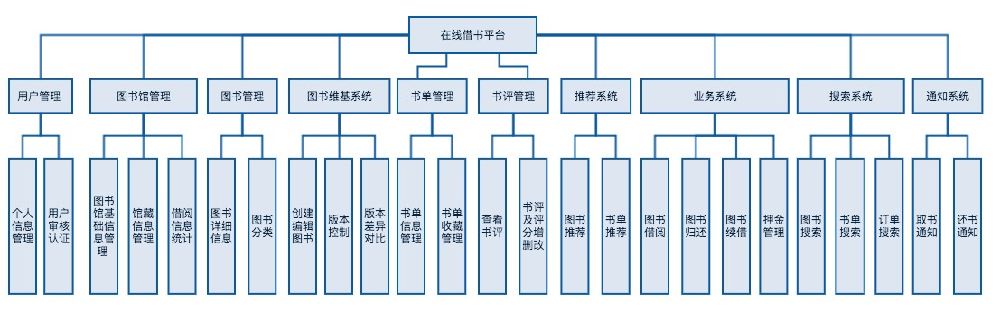

# 概要设计说明书
## 1. 引言
### 1.1 编写目的
此概要设计说明书面向开发人员，是开发人员进行数据库与软件详细设计的依据。
### 1.2 背景
本项目要求开发一个能够进行图书借阅的应用系统，连接图书馆与读者，实现图书借阅线上化，图书馆资源利用率最大化。
### 1.3 术语及缩略语定义
|术语、缩略语 | 解释|
|---|---|
|模块| 在前端开发中，可将一些JavaScript代码封装为一个模块，模块可对外暴露接口，其他代码可引入此模块，通过模块接口调用模块内部方法。一个模块是一个独立的算法与数据单元。|
|组件| 在前端开发中，一个组件包括：HTML（结构）、CSS（样式）与JavaScript（逻辑），用于实现一个特定的功能，并为此功能提供必要的界面元素。一个组件是一个独立的可视/可交互功能单元。|
| 模态框| 模态框是UI界面中的一个组件，它通常由标题、内容、确定/取消按钮三部分构成。模态框会覆盖在所有UI组件之上，用户只可对模态框进行操作，点击模态框的按钮才可将其关闭。
| RESTful API | 在RESTful API中，一个API对应为一个URL，参数不仅可附在GET、POST请求中，还可作为URL的一部分。如/api/users/1这个URL中的1也可以作为一个参数，等效于/api/users?id=1。|
| 请求（Request）| 在HTTP/HTTPS协议中，对一个URL采用某种方法(GET/POST/...)发送参数、获取响应内容的过程叫做一次请求。|
| 资源 | "资源"是一种信息实体，代表了数据库中的一类信息。在此系统中，user（用户）、book（图书）都是一种资源。|
| 数据对象 | 数据对象是编程语言中包含了数据的自定义对象，可直接访问到该对象中的属性。在客户端与服务器的通信中，数据对象通过JSON的形式交换。|
| 路由（后台） | 对于后台系统而言，当客户端请求一个API时，系统会将此请求发送至对应的处理函数，这个过程叫路由。
|路由（前端）|对于前端浏览器单页面应用而言，路由指：当URL变化时，并不会执行跳转，而是根据当前的URL控制或隐藏各个页面组件，以展示不同的页面。


### 1.4 参考资料
* 计算机软件文档编制规范GB8567-88


## 2. 总体设计

### 2.1 需求规定

参见《需求规格说明书》

### 2.2 运行环境

参见《需求规格说明书》

### 2.3 基本设计概念和处理流程

以下为关键业务的时序图。

#### 2.3.1 用户注册及设置用户信息时序图

这里的用户指使用小程序借阅图书的读者。图书馆管理员通过桌面端管理应用注册，注册流程与此类似，区别在于不需要从微信服务器获取用户昵称与头像。


#### 2.3.2 用户现场借书时序图

用户可直接在图书馆内选择自己需要的图书，扫描图书二维码将其加入借书栏；将所选图书与借书二维码展示给管理员，待管理员确认并登记后方可借阅图书。借书需要支付押金。


#### 2.3.3 用户预订/预约图书时序图

除现场借书外，用户也可通过微信小程序搜索图书及图书馆藏，并在小程序内在线借阅图书。当图书可借时，用户可选择取书日期，预订此图书；当图书暂无可借时，用户可选择预约此图书，系统将在图书可借时可用户发送取书通知。


#### 2.3.4 用户取书时序图

用户在小程序内完成图书预订后，需在约定时间前往图书馆取走图书。只有支付了押金才能取书。


#### 2.3.5 订单状态图


### 2.4 系统架构

#### 2.4.1 系统架构图


本项目采用三层架构，从上至下分为界面层、业务逻辑层、数据访问层。界面层为用户提供图形化界面，业务逻辑层处理各个业务，数据访问层对数据进行增删改查操作。

##### 连接机制

界面层与业务逻辑层通过**HTTPS**协议进行通信，传输数据格式为**JSON**。业务逻辑层提供了**RESTful风格的API架构**（见3：接口设计），简化API接口规则的同时提高了API的语义性、可修改性与可维护性。业务逻辑层通过开启pathinfo模式、设置Nginx服务器URL重写规则，以及使用Slim框架进行URL路由，实现了RESTful风格的API架构。

业务逻辑层通过Eloquent模型类访问数据层，**Eloquent数据库框架**封装了对MySQL数据库的操作，对外提供接口以实现对数据层的访问与修改。

#### 2.4.2 界面层子架构：用户小程序

##### 概述

用户小程序基于小程序框架、应用**组件化/模块化**模式进行开发。组件化使得页面结构清晰，页面元素高度复用；模块化降低了代码之间的耦合度。

小程序的框架管理了整个小程序的页面路由，可以做到页面间的无缝切换，并给以页面完整的生命周期。同时框架提供了一些微信的基本组件。用户小程序在这些基本组件的基础上，重新封装了多个自定义组件，它们构成了用户小程序中的各个页面。

##### 技术架构


小程序开发的模块化主要通过ES6语法实现，模块间通过exports对外暴露接口，通过require引入。

组件化主要通过1.9.0基础库提供的Component类实现。本项目从用户小程序中剥离出多个可复用组件：搜索框、弹出框、顶部提示、加载器等。

##### 文件结构

```
.
├── apis                  // 网络请求封装
├── app.js
├── app.json
├── app.wxss
├── components            // 可复用组件
│   ├── async-button      // 异步按钮
│   ├── async-switch      // 异步切换器
│   ├── collapse          // 可折叠容器
│   ├── load-more         // 加载更多
│   ├── no-data           // 暂无数据
│   ├── panel             // 带导航标题的面板
│   ├── popup             // 底部弹出层
│   ├── rate              // 可评半星的评分组件
│   ├── search-bar        // 带遮罩的搜索框
│   ├── send-code         // 发送验证码按钮
│   ├── spinner           // 加载中动画
│   ├── sticky            // 固定页头
│   ├── sticky-2          // 固定页头的另一种实现
│   ├── tab-bar           // 标签页
│   ├── toast             // 弹出提示
│   └── toptip            // 顶部提示
├── images                // 图标
├── package.json
├── pages                 // 页面，子页面在父页面的children文件夹中
│ └─components            // 与业务相关的特殊组件
├── project.config.json
├── styles                // 样式
├── templates             // 模板
│   ├── library-list      // 图书馆列表
│   ├── page-status-indicator // 页面加载状态，带有一个“重新加载”按钮
│   └── showcase          // 图书项目
└── utils                 // 辅助模块
    ├── biz-helper.wxs    // 业务相关辅助函数，用于wxml中
    ├── constant.js       // 业务常量
    ├── constant.wxs      // 业务常量，用于wxml中
    ├── es6-promise.js    // Promise语法支持
    ├── event.js          // 全局事件
    ├── permission.js     // 登录鉴权
    ├── promise-polyfill.js // Promise.finally()语法
    ├── promisify.js      // 微信小程序API Promise化
    ├── qrcode.js         // 二维码生成
    ├── tip.js            // 使用帮助
    ├── utils.js          // 辅助函数
    └── validator.js      // 正则校验器
```


##### 程序页面与功能需求的对应关系

本说明书用一个矩阵来表示页面与功能需求的对应关系，用编号来表示页面的层级关系。一级页面用A、B、C、D表示；每个一级页面的第一级子页面依次表示为A1、A2、...；第二级子页面表示为A11、A12、...；以此类推。

页面编号 | 页面名 | 功能需求编号(见需求规格说明书) | 补充说明
--- | --- | --- | ---
A | 主页 | 3.3 / 3.6.2 / 3.6.3 / 3.6.4 | 主页搜索框提交时，向图书列表页(A3)传递搜索参数
A1 | 学科分类 | 3.3.3
A2 | 高级搜索 | 3.3.4
A3 | 图书列表 | 3.3 | 根据主页传来的参数获取图书并展示
B | 注册页 | 3.1.1
C | 图书详情页 | 3.2.1 / 3.6.1 / 3.7.1
C1 | 加入书单 | 3.4.3
C2 | 确认订单 | 3.7.2
C3 | 查看书评 | 3.5.1
C11 | 订单结果 | 3.7.2
D | 书单页 | 3.4.1 
D1 | 书单详情 | 3.4.4 / 3.4.5
D2 | 创建书单 | 3.4.2
D3 | 修改书单信息 | 3.4.2
D4 | 书单搜索
D11 | 设置图书个性化描述
E | 借书栏 | 3.7.3
E1 | 借书二维码 | 3.7.3
E2 | 借书步骤 | 3.7.3
D | 我的 | 无 | 为用户提供不同页面的导航菜单
D1 | 我的书评 | 3.5.2
D2 | 借阅进度 | 3.8.1
D3 | 借阅历史 | 3.8.1
D4 | 个人详细信息 | 3.1.2
D5 | 我的押金 | 3.7.4
D11 | 订单详情 | 3.7.5 / 3.8.2 / 3.8.3 / 3.8.4
D12 | 个人信息修改 | 3.1.2 

#### 2.4.3 界面层子架构：桌面管理应用

##### 概述

桌面管理应用开发模式为**组件化开发**。桌面端没有微信小程序内的限制，能够实现组件内的局部CSS、局部数据、局部逻辑、子组件等特性。基于此，我们在桌面管理应用中封装了多个组件，在组件内实现了**数据驱动的界面渲染**，实现了组件的**高内聚、低耦合、高度可复用**。通过页面路由与页面打包，我们最终生成了一个跨平台的单页面应用。

##### 技术架构


桌面端管理应用的组件化主要通过**Vue**与**Webpack**实现。

技术名称 | 描述
--- | ---
HTML, CSS, JavaScript | 前端开发基本语言
Vue | 前端MVVM框架，支持数据驱动的视图更新，支持组件定义，支持基于组件的路由加载
Axios | 前端网络框架，封装了Primise语法，实现了观察者模式下的网络请求
Element UI | 基于Vue的前端UI框架，提供了多种界面美观、体验良好的UI组件
Webpack | 前端打包工具，对Vue组件进行编译，将编译后的代码及依赖模块打包为一个单页面应用
Node.js | Webpack的运行环境

桌面端管理应用最终实现为一个单页面应用，管理员可直接通过`Ctrl + S`将页面保存在桌面，并可在多个操作系统获得相同的使用体验。

##### 程序组件与功能需求的对应关系

本说明书用一个矩阵来表示组件与功能需求的对应关系：

组件名称 | 功能需求编号(见需求规格说明书) | 补充说明
--- | ---  | ---
登录表单 | 3.10.1
注册表单模态框 | 3.10.2
折线图图表 | 3.10.3 | 展示近期借阅信息
信息卡片 | 3.10.3 | 展示图书馆信息
馆藏列表 | 3.11.1 | 包括三个子组件：表格、搜索表单与分页
馆藏表单模态框 | 3.13.2
订单列表 | 3.13.1 / 3.13.2 | 包括三个子组件：表格、搜索表单与分页
订单信息表单模态框 | 3.13.3 
页头 | 无 | 包括页面标题、导航链接与用户信息
表格 | 无 | 以表格的形式展示数据
搜索表单 | 无 | 包括输入框、多选框、搜索按钮、重置按钮
分页 | 无 | 展示当前页号及相邻页号，用户可点击页号跳转至对应页面

#### 2.4.4 界面层子架构：安卓管理员应用

##### 概述

安卓管理员应用中包含了管理员使用最频繁的功能：借书、还书。安卓管理员应用力求操作简单便捷，能够快速做出相应，更复杂的操作在桌面管理应用中完成。

##### 架构图


##### 程序页面与功能需求的对应关系

本说明书用一个矩阵来表示组件与功能需求的对应关系：

类名 | 功能需求编号(见需求规格说明书) | 补充说明
--- | ---  | ---
LoginOrderActivity | 3.10.1 | 登录
TakeOrderActivity | 3.12.1 | 取书
BookOrderActivity | 3.12.2 | 线下借书
ReturnOrderActivity | 3.12.3 | 还书

#### 2.4.5 业务逻辑层子架构

::: warning 注意
此章节内容已过时，新的后台系统使用`Slim`与`Eloquent`重构，请参考[后端](../guide/back.md)。
:::

##### 概述

本项目实现了业务逻辑与数据访问的分离。业务逻辑层以PHP为开发语言，基于ThinkPHP框架进行开发。

我们定义了**RESTful风格的API架构**（见3：接口设计），界面层通过这些API与业务逻辑层进行通信。业务逻辑层的具体实现方式为：

* 开启pathinfo模式支持
* 设置Nginx服务器URL重写规则
* 使用Slim框架进行URL路由、获取URL中的变量

##### 业务逻辑层架构图


上图中蓝色部分为业务逻辑层，业务逻辑层分为两个子层：Controller层与Event层。

当界面层通过URL请求业务逻辑层的API时，ThinkPHP框架会按照路由规则将请求重定向至对应的Controller对象，**Controller对象会分析URL，判断该URL所对应的操作；然后获取URL与请求中的参数、将参数传递给Event对象中对应的业务函数**。

Event层中定义了处理各个业务模块的业务逻辑的实现类。每个类中均有多个方法，执行不同的业务。**Event类中的方法会检查参数格式、对参数进一步处理；然后将处理后的参数传递给数据层相应接口，获取到数据层返回的数据对象；对数据层返回的数据做进一步处理，向Controller返回封装好后的JSON字符串**。

Event层中包含4个支持模块，分别是：

* Constant：定义了各种常量与配置信息，如是否开启开发模式、订单状态码等
* Common：定义了各种常用函数，如debug日志的打印、字符串的拼装
* Message：发送短信，当OrderEvent中检测到需要通知时被调用
* Recommend：推荐系统，通过用户在系统中的行为计算用户的推荐图书与推荐书单

Controller与Event子层均按照业务模块分为六个类，与数据访问层中的类一一对应，整个后台系统实现了**MVC架构**。


##### 程序与功能需求的对应关系

业务逻辑层按照系统架构图中的业务模块划分了多个类，实现了对应业务模块下的所有业务需求。

#### 2.4.6 数据访问层子架构

::: warning 注意
此章节内容已过时，新的后台系统使用`Slim`与`Eloquent`重构，请参考[后端](../guide/back.md)。
:::

##### 概述

数据库访问层在Medoo数据库框架的基础上做了进一步封装，结合业务需求，为各个业务模块定义了访问数据库的类与接口。这些类接受业务层传来的参数与条件，从数据库中获取/修改信息，返回包装后的**数据对象**。

##### 数据访问层架构图


Medoo框架将数据库操作封装为select(), get(), insert(), update()等方法，不需要开发人员编写SQL语句。我们对Medoo进一步封装，与业务需求适配。如，业务逻辑层只需要为Book类中的getBooks()传递查询条件，即可获取到包含了图书详细信息（标题、作者、译者、...）的数组。

具体数据格式定义见3：接口设计。

### 2.5 人工处理过程

当用户借书时，管理员需检查用户证件与用户注册信息是否一致。如不一致，拒绝用户借书。


## 3. 接口设计
### 3.1 用户接口

系统为用户提供图形接口，主要元素为：输入框、按钮、菜单、导航器，用户可通过手指或鼠标点击完成基本操作。


### 3.2 外部接口

微信登录授权接口，微信支付接口。

### 3.3 内部接口

对于界面层与业务逻辑层内部的接口描述，已在2.4中做了描述，此处只针对界面层与业务逻辑层之间的接口（以下简称API）进行设计。

#### 3.3.1 基本设计

我们**基于RESTful架构进行API设计**。在RESTful架构中，API的设计以“资源”为主体，通过HTTP的不同的请求方法，为API赋予动作语义，并通过HTTP状态码表示服务器对API请求的执行结果。

HTTP有多种请求方法，对应多种语义。我们使用以下三种请求方法：

* GET：从服务器获取指定的信息
* POST： 向指定资源提交数据，修改此资源
* DELETE：删除服务器的指定资源

HTTP多种状态码，我们使用了以下四种状态码表示执行结果：

* 200：操作成功
* 201：创建资源成功
* 400：参数不合法（缺少必要参数或参数格式错误）
* 401：认证失败
* 403：无权限
* 404：资源不存在
* 500：服务器内部错误

另外，基于业务需求，我们对API的返回信息做了如下约定：

* 界面层向服务器发送的数据、服务器返回的数据均为JSON格式
* 对一级路径进行GET请求时，返回数据资源的数组（如：GET /users，返回多个用户的信息）。客户端可设置start与count，分别代表数据的偏移与返回数据的个数，服务器应为start与cout设置默认值
* 对一级路径进行POST请求时，表示向该资源添加数据（如：POST /users，表示添加一名用户）
* 对二级路径进行GET/POST/DELETE请求时，表示对一个特定的数据资源进行操作（如：GET /users/1，返回id为1的用户的信息；POST /users/1，表示修改id为1的用户的信息；DELETE /users/1，表示删除id为1的用户）
* 对于所有POST请求，服务器应返回修改后的数据资源

#### 3.3.2 接口定义

我们利用YAML语言对接口路径、接口参数、参数约束、返回信息格式等作了详细定义，接口文档发布在Swagger上，[点击这里](https://app.swaggerhub.com/apis/imageslr/weapp/1.0.1)可查看文档。以下是对Swagger界面的介绍。


## 4. 系统数据结构设计

::: warning 注意
此章节内容已过时，请参考[数据库与模型类](../guide/back.md#数据库与模型类)。
:::

### 4.1 逻辑结构

#### ER图


#### biz_deposit：押金信息表
|字段 |类型 |空  |默认|描述|
|---|---|---|---|---|
|id |int(11)|否|主键|表项id| 
|state  |int(11)|否| |押金状态：0：未退还；1：已退还|
|user_user_id|int(11)|否| |用户ID|
|deposit_amount|float|否| |押金金额|
|is_returned|int(11)|否| |押金是否退还|
|return_amount|float|否| |押金退还金额|
|create_time|datetime|否|CURRENT_TIMESTAMP|表项创建时间|
|modify_time|datetime|否| |表项修改时间|
|return_time|datetime|否 | |押金退还时间|

#### biz_order：订单信息表
|字段|类型|空|默认|描述|
|---|---|---|---|---|
|id|int(11)|否| |订单id|   
|state|int(11)|否| |订单状态，见2.3.5订单状态图|
|user_user_phone|varchar(20)|否| |用户手机号|
|bk_book_id|int(11)|否| |用户借阅的图书的id|
|lib_library_id|int(11)|否| |用户借阅图书馆的id|
|should_take_time|datetime|是|NULL|用户预约的取书时间|
|actual_take_time|datetime|是|NULL|用户实际的取书时间|
|renew_count|int(11)|是|1|剩余续借次数|
|should_return_time|datetime|是|NULL|应当归还的时间|
|actual_return_time|datetime|是|NULL|实际归还的时间|
|fine|float|否|0|罚款金额|
|create_time|datetime|否|CURRENT_TIMESTAMP|订单创建时间|
|modify_time|datetime|否|CURRENT_TIMESTAMP|订单修改时间|
|finish_time|datetime|是|NULL|订单结束时间|
|take_notice|int(11)|否|0|是否已经发送过取书提醒|
|return_notice|int(11)|否|0|是否已经发送过提取七天还书提醒|
|return_overdue_notice|int(11)|否|0|是否已经发送过预期还书提醒|

#### bk_book：图书信息表
|字段|类型|空|默认|描述|
|---|---|---|---|---|
|id|int(11)|否| |书的ID|
|title|varchar(100)|否| |书的标题|
|origin_title|varchar(100)|是|NULL|原标题|
|subtitle|varchar(100)|是|NULL|子标题|
|isbn|varchar(20)|是|NULL|书的ISBN编号|
|language|varchar(10)|是|NULL|书的语种|
|publisher|varchar(50)|是|NULL|出版社|
|pubdate|varchar(20)|是|NULL|出版时间|
|pubdate_full|datetime|是|NULL|出版时间|
|series|varchar(50)|是|NULL|丛编|
|series_item|varchar(50)|是|NULL|丛编项|
|class_num|varchar(50)|是|NULL|分类号|
|personal_author|   varchar(50)|是|NULL|个人著者|
|organization_author|varchar(50)|是|NULL|团体著者|
|binding|varchar(11)|是|NULL|图书装订|
|price|float|是|NULL|图书价格|
|page|int(11)|是|NULL|图书页数|
|word|int(11)|是|NULL|图书字数|
|description|text|否| |图书描述|
|summary|text|是|NULL|图书摘要|
|catalog|text|是|NULL|图书分类|
|preview|text|是|NULL|图书简介|
|img_small|varchar(100)|是|NULL|小尺寸图片地址|
|img_medium|varchar(100)|是|NULL|中尺寸图片地址|
|img_big|varchar(100)|是|NULL|大尺寸图片地址|
|call_number|varchar(20)|是|NULL|索书号|
|total_score|float|是|NULL|评分|
|create_time|datetime|否|CURRENT_TIMESTAMP|记录创建时间|
|modify_time|datetime|否|CURRENT_TIMESTAMP|修改记录时间|

#### bk_booklist：书单信息表
|字段|类型|空|默认|描述|
|---|---|---|---|---|
|id|int(11)|否| |书单id|   
|phone|varchar(20)|否| |用户手机号|
|title|varchar(100)|否| |书单标题|
|description|varchar(200)|否| |书单描述|
|create_time|datetime|否|CURRENT_TIMESTAMP|创建时间|
|modify_time|datetime|否|CURRENT_TIMESTAMP|修改时间|

#### bk_booklist_item：书单-图书关系表，记录书单内包含的图书
|字段|类型|空|默认|描述|
|---|---|---|---|---|
|bk_booklist_id|int(11)|否|  |书单id|
|bk_book_id|int(11)|否|  |图书id|
|description|varchar(300)|是|NULL|图书个性化描述|
|create_time|datetime|否|CURRENT_TIMESTAMP|创建时间|
|modify_time|datetime|否|CURRENT_TIMESTAMP|修改时间|

#### bk_booklist_user：书单收藏表，记录了用户收藏的书单
|字段|类型|空|默认|描述|
|---|---|---|---|---|
|bk_booklist_id|int(11)|否| |书单id|
|phone|varchar(20)|否| |用户手机号|

#### bk_classification：图书分类表，以树的数据结构表示了图书分类的层次关系
|字段|类型|空|默认|描述|
|---|---|---|---|---|
|num|varchar(10)|否| |分类号|
|name|varchar(50)|是|NULL|分类名|
|son_num|varchar(10)|是|NULL|分类树的子节点|
|parent_num|varchar(10)|是|NULL|分类树的父节点|
|next_num|varchar(10)|是|NULL|分类树的兄弟结点|
|create_time|datetime|否|CURRENT_TIMESTAMP|分类的创建时间|

#### bk_recommendation_book：推荐图书表
|字段|类型|空|默认|描述|
|---|---|---|---|---|
|id|int(11)|否| |表项id|
|phone|varchar(20)|否|用户手机号|
|bk_book_id|int(11)|否| |推荐的图书id|
|reate_time|datetime|否|CURRENT_TIMESTAMP|推荐信息创建时间|
|odify_time|datetime|否|CURRENT_TIMESTAMP|推荐信息修改时间|

#### bk_recommendation_booklist：推荐书单表
|字段|类型|空|默认|描述|
|---|---|---|---|---|
|id|int(11)|否| |推荐书单的id|
|phone|varchar(20)|否| |用户手机号|
|bk_booklist_id|int(11)|否| |书单id|
|create_time|datetime|否|CURRENT_TIMESTAMP|推荐的创建时间|
|modify_time|datetime|否|CURRENT_TIMESTAMP|推荐的修改时间|

#### bk_review：图书评论表
|字段|类型|空|默认|描述|
|---|---|---|---|---|
|id|int(11)|否| | 评论id|  
|bk_book_id|int(11)|否| |评论的图书id|
|user_user_phone|varchar(15)|否|用户手机号|
|score|float|是|NULL|评分|
|content|text|否| |评论内容| 
|create_time|datetime|否|CURRENT_TIMESTAMP|创建时间|
|modify_time|datetime|否|CURRENT_TIMESTAMP|修改时间|

#### lib_library：图书馆信息表
|字段|类型|空|默认|描述|
|---|---|---|---|---|
|id|int(11)|否| |图书馆id|  
|name|varchar(20)|否| |图书馆名|
|phone|varchar(20)|是|NULL|图书馆电话|
|location|varchar(200)|否| |图书馆地址|
|locationx|float|否| |图书馆经度|
|locationy|float|否| |图书馆纬度|
|description|varchar(300)|是|NULL|图书馆描述|
|admin_phone|varchar(20)|是|NULL|管理员手机号|
|admin_name|varchar(20)|是|NULL|管理员姓名|
|admin_password|varchar(50)|是|NULL|管理员密码|

#### lib_library_collection：图书馆馆藏表
|字段|类型|空|默认|描述|
|---|---|---|---|---|
|id|int(11)|否| |表项id|   
|lib_library_id|int(11)|否| |图书馆ID|
|bk_book_id|int(11)|否| |图书ID|
|bk_book_isbn|varchar(20)|否| |图书ISBN|
|total_num|int(11)|否| |图书总数|
|available_num|int(11)|否| |图书可借数量|
|is_available|int(11)|否| |图书是否可借|
    
#### tmp_vrcode：验证码表
|字段|类型|空|默认|描述|
|---|---|---|---|---|
|id|int(11)|否| |表项id|   
|phone|varchar(15)|否| |用户手机号|
|vrcode|varchar(10)|否| |验证码|
|expiry|int(11)|否|600|验证码有效期，默认为10分钟|
|create_time|datetime|否|CURRENT_TIMESTAMP|创建时间|
|modify_time|datetime|否|CURRENT_TIMESTAMP|修改时间|

#### user_profile：用户个人资料表
|字段|类型|空|默认|描述|
|---|---|---|---|---|
|id|int(11)|否| |表项id|   
|phone|varchar(50)|否| |用户手机号|
|username|varchar(50)|否| |用户昵称|
|avatar_url|varchar(200)|否|  |用户头像URL|
|name|varchar(100)|否| |姓名|
|location|varchar(200)|否| |住址|
|birthday|datetime|是|NULL|出生日期|
|id_number|varchar(20)|否| |身份证号|
|post_code|varchar(10)|否| |邮政编码|
|create_time|datetime|否|CURRENT_TIMESTAMP|创建时间|
|modify_time|datetime|否|CURRENT_TIMESTAMP|修改时间|

#### user_user：用户表
|字段|类型|空|默认|描述|
|---|---|---|---|---|
|id|int(11)|否| |用户id|
|phone|varchar(15)|否| |用户手机号|
|create_time|datetime|否|CURRENT_TIMESTAMP|创建时间|
|modify_time|datetime|否|CURRENT_TIMESTAMP|修改时间|


### 4.2 数据结构与程序的关系

业务模块名 | 所使用的数据表
--- | ---
用户管理系统 | user_user, user_profile, tmp_vrcode
图书馆管理系统| lib_library, lib_library_collection
图书系统 | bk_book, bk_classification
书单系统 | bk_booklist, bk_booklist_item, bk_booklist_user
书评系统 | bk_review
业务系统 | biz_order, biz_deposit
推荐系统 | bk_recommendation_book, bk_recommendation_booklist
通知系统 | biz_order

## 5. 系统出错处理设计
### 5.1 后台业务系统
Slim 框架提供了全局的错误处理器用于接收所有未捕获的 PHP 异常。在 [API](api.md#错误对象) 中提到过：所有错误情况**一定会**返回一个错误对象。因此，本项目定义了若干个异常类，用于封装错误代码`code`和错误消息`message`、`err_msg`。在[ error_handlers.php ](https://github.com/imageslr/library-api/tree/master/bootstrap/error_handlers.php)中定义了多种错误处理器，用于捕获错误，返回错误对象。

### 5.1.1 示例代码
下面的代码捕获`Respect\Validation`抛出的参数异常错误，返回 400 状态码与错误对象，错误对象中附带明确的错误说明信息：

```PHP
// Validator 参数校验错误
if ($exception instanceof ValidationException) {
    return $c['response']
        ->withStatus(400)
        ->withJson(new BadRequestException(
          INVALID_PARAM, 
          $exception->getMessage()
        ));
}
```

### 5.1.2 示例错误对象
以获取验证码接口`POST /codes`为例。该接口参数必须包含手机号`phone`。现在请求该接口，不附加任何参数，得到的服务器响应如下：

```JSON
{
    "code": 400,
    "message": "参数校验错误",
    "err_msg": "phone 必须是一个11位中国大陆手机号"
}
```
这个错误对象就是由上面示例代码中的`ValidationException`错误处理器返回的。
系统具有良好的出错信息输出与处理功能。
 
## 5.2 前端应用
对于用户界面层的应用，使用Promise语法中的`Promise.then().catch()`捕获错误。当后台系统返回错误时，程序将显示一个模态框提示用户发生错误，并在控制台打印错误信息。
 


## 6. 部署结构


本系统服务器部署于腾讯云服务器，配置为：

* CPU：1核
* 内存：1GB
* 最大传输速率：1Mbps
* 系统盘：云硬盘
* 网络协议：SSL证书，HTTPS协议

## 7. 功能架构



依据用户需求，本系统划分为10个主功能模块，每个主功能模块下有多个子模块。

## 8. 关键技术

### 8.1 用户微信小程序

微信小程序的API是基于回调设计，利用这些API写出的代码层层嵌套、结构混乱。因此，我们利用ES6 Promise语法对微信API进行了改造，所有模块均基于Promise对象实现同步数据流传递与异常捕获，极大地优化了代码结构，简化代码逻辑。见[2.4.2(用户小程序-技术架构)](#_2-4-2-界面层子架构：用户小程序)。

### 8.2 桌面端管理员应用

传统前端网页开发需为每个页面定义HTML/CSS/JavaScript代码，每次切换页面时均需发起多次网络请求，且不支持组件化开发。我们利用Vue实现数据驱动的界面渲染，自定义组件，实现组件化开发。通过Webpack编译Vue自定义组件，将所有页面打包为一个单独的应用，压缩了文件体积，减少网络请求，实现应用的跨平台。见[2.4.3(桌面管理应用-技术架构)](#_2-4-3-界面层子架构：桌面管理应用)。

### 8.3 后台系统

基于Slim框架开发。Slim提供URL路由功能，是后端RESTful API架构的实现基础。见[2.4.5(业务逻辑层架构图)](#_2-4-5-业务逻辑层子架构)、[3.3(内部接口)](#_3-3-内部接口)。

## 9. 其他

### 9.1 第三方包

第三方包名 | 原因、目的及实现的功能 
---|---
es6-promise.js | 为微信小程序提供Promise语法支持，见8.1
weui | 微信风格的UI组件，基于此开发美观大方的用户微信小程序
axios 0.15.3 | 基于Promise语法的前端网络请求库
vue 2.1.8 | 前端MVVM框架，组件化开发的基础，见8.2
vue-router 2.3.1 | vue路由组件，管理桌面端管理员应用的路由
vue-echarts 2.4.0 | 基于vue的图表组件
element-ui 1.1.2| 基于vue的UI组件，界面美观，用户体验良好，基于此开发桌面端管理员应用
zxing 1.0 | 安卓端扫码控件
Slim 3.0| 为后台系统提供URL路由功能，是后端RESTful API架构的实现基础


### 9.2 数据获取来源

#### 9.2.1 概述
本系统所面向的是真实的图书馆，为保证更高的通用性，更加贴近使用环境，我们没有单纯地采用豆瓣上的数据，而是通过直接采集图书馆中的分类与图书信息对系统进行测试。这使得我们的系统在投入使用时，尽可能少地缩短调试及适配工作所需时间，导入图书馆的数据即可直接使用。图书管理员也无需手动录入大量图书信息，只需输入ISBN编号便可设置图书馆藏，系统会自动查询此ISBN对应的图书的详细信息。
目前网络上并没有公开完善的图书馆数据库，因此我们使用爬虫对北京工业大学图书馆的图书馆馆藏进行数据收集操作。数据源地址：[北京工业大学图书馆](http://lib.bjut.edu.cn/)


#### 9.2.2 数据收集与处理
收集的数据分为两部分：图书分类信息与图书信息。
##### 图书分类信息
图书馆的分类具有很强的科学性，并非单纯基于类似于豆瓣的标签分类法。目前权威性较高，适用范围较大的分类法有《中国图书馆图书分类法》，其共有五个基本部类，二十二个大类，所有的子分类共有约五万个左右。在图书馆中，展示给使用者的是一个树形结构：


该数据库在网上没有公开的数据，因此我们分析了图书馆在分类获取过程中的请求信息，通过编写网络爬虫代码，将图书馆的所有分类信息保存下来，并维持了原数据结构的完整性（包括分类的父子关系、兄弟关系等），存入到了我们的图书馆程序的后台数据库中。

##### 图书信息

我们同样编写了网络爬虫对图书馆中部分图书的信息进行了采集。

图书馆的图书展示页面如下：


采集的内容包括了图书的标题、ISBN、封面、个人作者、团体作者、出版社、作品语种、中图分类号、索书号等信息。目前我们的数据库中保存有五万余本图书的相关信息，并在不断增加。

### 9.3 推荐算法

我们基于图书类别推荐相似图书，具有极高的推荐准确度；根据用户对图书的评分、搜索记录、借阅记录、收藏的图书等历史操作，采用协同过滤算法为用户推荐他可能感兴趣的图书与书单。

在后期我们计划采用深度神经网络为用户推荐图书。我们会将用户在小程序内的所有操作加以统计分类，为各个特征值设定权值，设计大量样本来训练此神经网络，以为用户推荐与其喜好更符合的图书与书单，激发用户的读书兴趣。


