# 需求规格说明书
## 1. 引言
### 1.1 目的
编写此文档的目的是定制本项目开发的细节问题，希望能使本项目开发工作更具体。此文档说明了项目的各项功能需求和非功能性需求。文档结合UML用例图与产品原型（UI界面描述+UI逻辑描述），直观明确表示了各功能的实现过程，详细准确地描述了用户需求，为用户更容易地理解这些需求的描述创造了条件。
此文档中的规格说明是进行设计与开发的基础，也是编写测试用例和进行系统测试的主要依据。同时，此文档也是用户确定软件功能需求的主要依据。
### 1.2 适用范围
在当今社会，人们的阅读习惯正在悄然发生着改变。随着科技发展与社会进步，人们有了更多时间与方式去读书。无论是为了娱乐消遣，还是为了提升自我，人们的读书需求始终在不断提升，对图书的需求也日益增长。许多人习惯于使用手机等电子设备阅读，原因是因为在信息时代，电子设备提供了丰富的阅读渠道与无数的信息。但是，与纸质书相比，电子设备的信息有着明显的缺点，即信息的碎片化。尽管人们每天花费许多的时间浏览电子设备中的各种信息，但是他们并不能从中获取到真正的知识，且在繁杂冗余的网络信息的冲击下，人们往往会失去独立思考的能力，而被动地接收着无用和不实的信息。阅读纸质书，不仅能获得更优质的内容，也能在阅读的过程中静心思考，完善自我。

如今人们阅读纸质书的频率越来越低，主要原因是购买纸质书需要成本，而从图书馆借书步骤繁琐：每个图书馆都需要办卡、缴纳押金；图书无法在线预约；不同的图书馆馆藏资源不共享，用户往往需要去多个图书馆才能找到自己想要的图书。因此，我们开发了一套图书馆借阅系统，包括面向用户的微信平台小程序、面向图书馆的安卓端管理app、桌面端管理应用、以及完整的后台系统，旨在有效整合图书馆和用户的资源，培养用户读书习惯，提高图书资源的利用率。

### 1.3 术语及缩略语定义

|术语、缩略语 | 解释|
|---|---|
|小程序| 本项目中微信端“在线借书平台”小程序的缩略语。|
|安卓管理app|本项目中安卓端管理员应用的缩略语，图书馆管理员可通过此应用实现借书、还书操作。|
|桌面管理应用|本项目中桌面端管理员应用的缩略语，具体实现方式为浏览器单页应用，支持跨平台使用。图书馆管理员可通过此应用实现图书馆信息设置、馆藏管理、订单管理等多种操作。|
|用户 | 小程序的使用者，借书行为的发起者，即读者。|
|图书馆管理员/管理员 | 安卓管理员app、桌面管理端的使用者。一个图书管理员对应着一个图书馆，负责为其所在图书馆注册管理员管理员账号，并利用此账号修改图书馆基本信息、管理图书馆馆藏信息、处理用户借书/还书业务等。|
|订单|当用户在图书馆预约或借一本书时，将生成一个订单，记录此次借书行为的详细信息。|
|预约|当用户A选择的图书在某图书馆暂无可借时，用户A可选择在小程序预约此图书，当其他用户归还时，系统将给用户A发送取书通知。|
|预订|当用户选择的图书在某图书馆可借时，用户可预订此图书，并在约定的时间前往图书馆取书。此图书将在用户预订后为用户保留。|

## 2. 系统概述
### 2.1 产品描述
本项目的目标是：

1. 简化借阅流程：用户可通过小程序在线查找图书及馆藏、预约/借阅图书；当用户在图书馆的时候，也可通过小程序扫描图书的ISBN，将图书加入借书栏；管理员只需要通过安卓管理app扫描用户借书二维码即可自动完成订单的创建或修改，无须手动录入信息。
2. 培养用户读书习惯：推荐系统会根据用户阅读习惯为其推荐书籍；书单功能使用户可以管理与分享自己的书单；书评功能使用户能交流自己的读书体会。这些功能都能激发用户的读书欲望，进而培养用户的读书习惯。
3. 图书借阅线上化：图书馆可在系统中注册，通过安卓管理app实现借书/还书的自动化登记，通过桌面应用实现图书馆信息设置/馆藏管理/订单管理等功能。
4. 图书资源利用率最大化：系统中存有图书馆的所有馆藏，当用户需要借阅某本图书时，可在小程序内直接获取所有图书馆的馆藏信息，无需对每个图书馆分别查找，因此一些图书馆的闲置资源也能得到充分利用。

本项目共包括五个软件与对应的后台系统。五个软件分别为：

1. 微信小程序：面向读者。
2. 安卓端管理员app：面向图书馆管理员。
3. 图书馆桌面管理应用：面向图书馆管理员。
4. 图书维基系统应用：面向所有用户。
5. 超级管理员桌面应用：面向平台管理员。

软件基于WeUI设计规范与ElementUI设计规范开发，设计风格良好，功能完善，逻辑清晰，使用者不需任何学习曲线即可立即上手。

### 2.2 产品功能
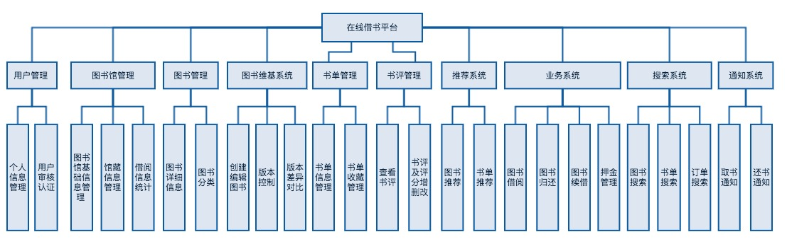

**（一） 用户管理系统**

1. 用户注册/登录
2. 个人信息修改

**（二）图书馆管理系统**

1. 图书馆信息管理
2. 馆藏信息管理

**（三）图书管理系统**

1. 图书信息管理
2. 图书分类管理

**（四）书单管理系统**

1. 书单信息管理
2. 书单收藏管理

**（五）书评系统**

1. 书评查看/增加/删除

**（六）推荐系统**

1. 图书推荐
2. 书单推荐

**（七）业务系统**

1. 图书借/还管理
2. 押金管理

**（八）搜索系统**

1. 图书搜索
2. 书单搜索
3. 订单搜索

**（九）通知系统**

1. 取书通知
2. 还书通知

### 2.3 系统用例模型
为方便描述，按照先整体用例、后子用例的方式描绘系统用例。

#### 系统整体用例图
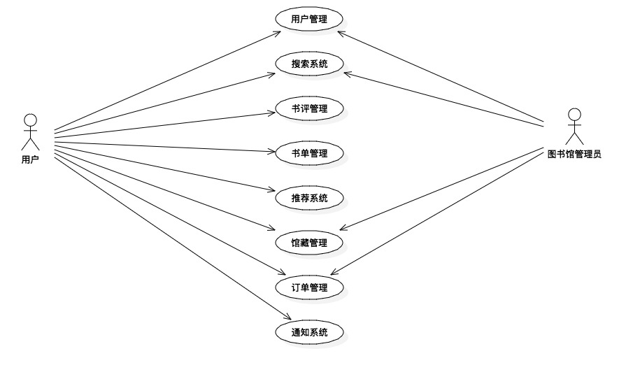

#### 用户管理子用例
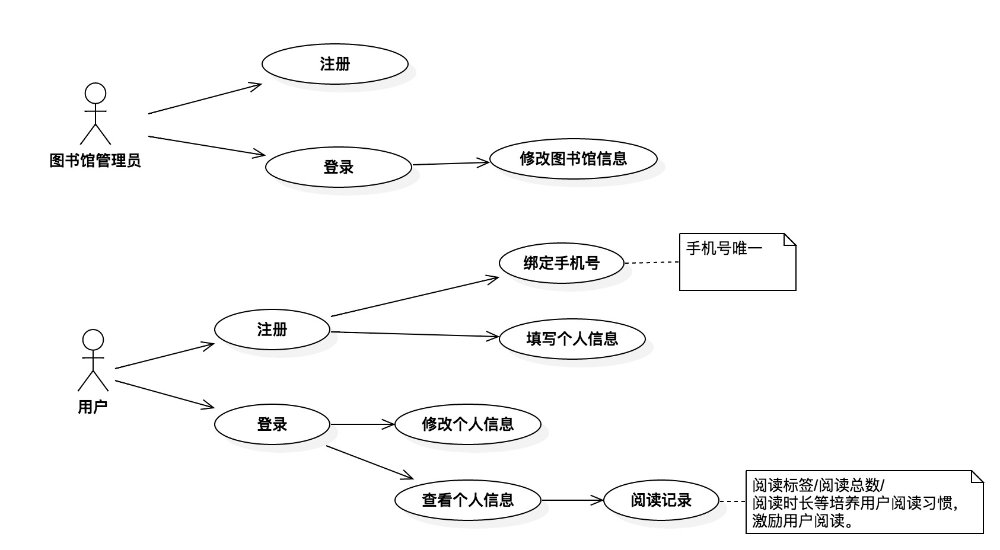

#### 搜索系统子用例
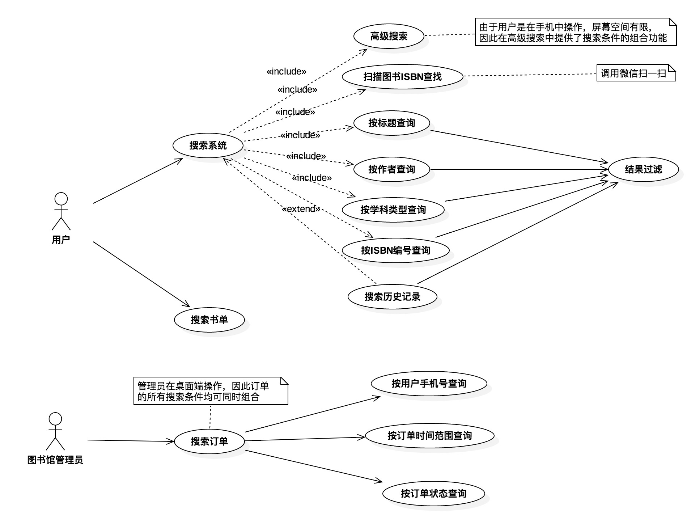

#### 书评管理子用例
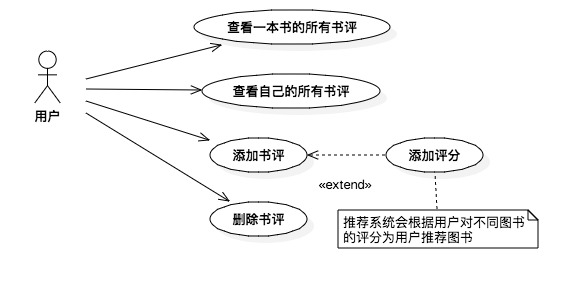

#### 书单管理子用例
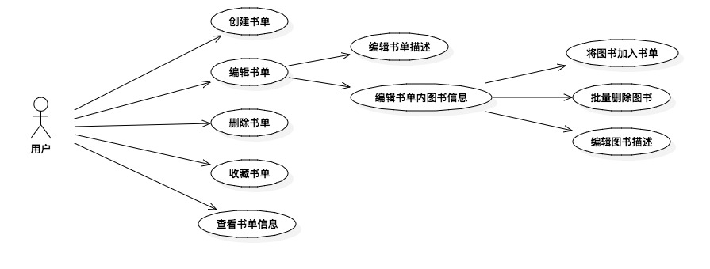

#### 推荐系统子用例
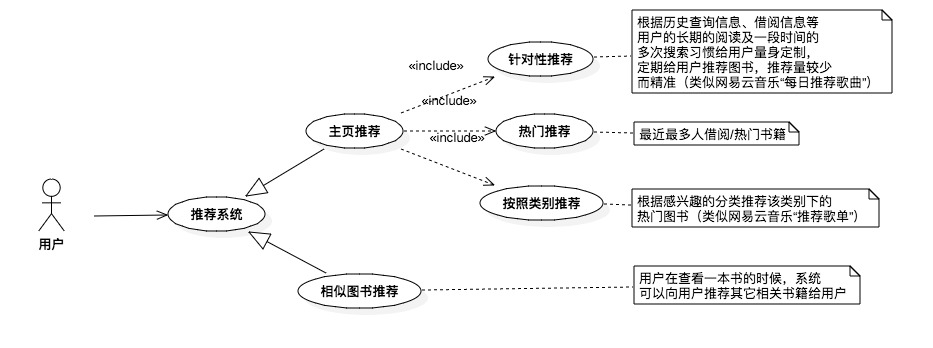

#### 馆藏管理子用例
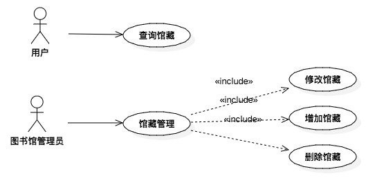

#### 订单管理子用例
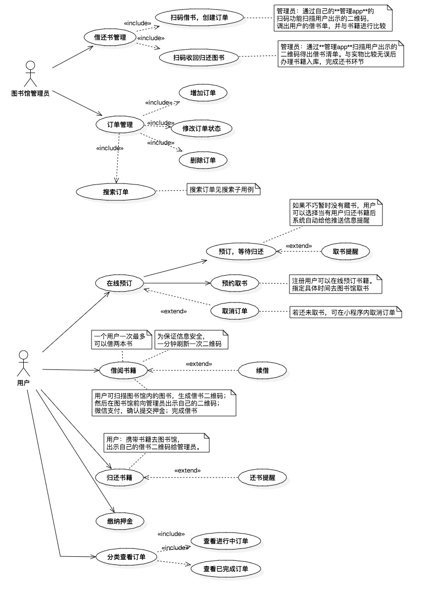

#### 通知系统子用例
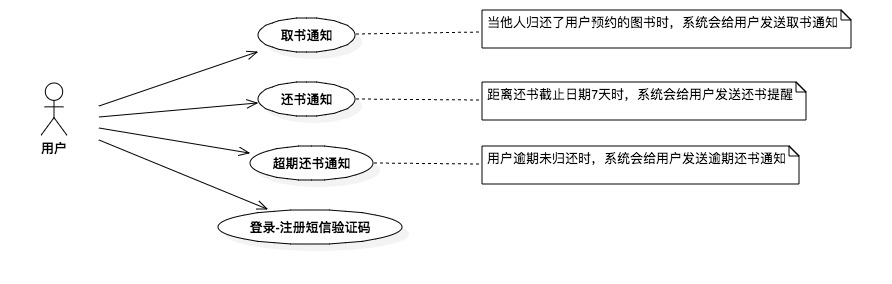

### 2.4 一般约束
该系统为C/S+B/S架构，运行环境分为客户端、浏览器、服务器三部分，预期软件环境如下：

* 用户软件环境：微信小程序+服务器
* 图书馆管理员软件环境：安卓端管理app/浏览器（桌面端管理应用）+服务器

为使系统达到预期性能，对软件的运行环境做如下规定：

* 微信小程序：安卓/iOS微信最新版本
* 安卓端管理app：安卓4.0以上版本
* 桌面端管理应用：Google Chrome等现代浏览器
* 后台服务器：Ubuntu系统，LNMP服务器环境

## 3. 功能性需求
在软件开发前，我们根据需求设计了产品原型，设计工具为Sketch + WeUI Design Kit。

由于本项目共涉及三个应用程序与两个角色（用户，图书馆管理员），为方便描述，我们从不同角色的角度出发描述了功能性需求：3.1 - 3.19为用户的功能性需求，3.10 - 3.13为图书馆管理员的功能性需求。

### 3.1 用户管理

#### 3.1.1 用户注册/登录

##### 使用场景

微信小程序

##### 参与者

用户（读者）

##### 需求描述

* 用户填写手机号，系统发送短信验证码。若验证码匹配且用户已注册，则跳转到主页；若验证码匹配且用户未注册，则跳转到填写个人信息页
* 验证码发送完一次后需等待一段时间才能继续发送
* 系统应检测表单数据格式，对错误内容给出相应提示
* 系统应实时展示表单提交状态，验证码错误或提交失败时给出相应提示

##### 软件原型
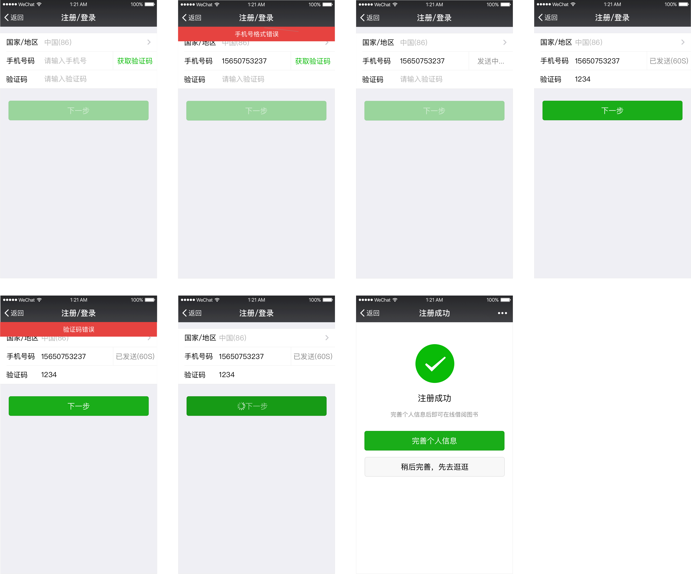

#### 3.1.2 查看/修改个人信息

##### 使用场景

微信小程序

##### 参与者

用户（读者）

##### 需求描述

* 用户可以查看与修改自己的个人信息，个人信息包括：昵称、头像、姓名、出生日期、身份证号、地址、邮政编码
* 系统应申请用户登录权限，从微信服务器获取用户的昵称与头像；如用户拒绝，应为用户生成一个随机昵称与头像
* 系统应检测表单数据格式，对错误内容给出相应提示
* 系统应实时展示表单提交状态，提交失败时给出相应提示

##### 软件原型

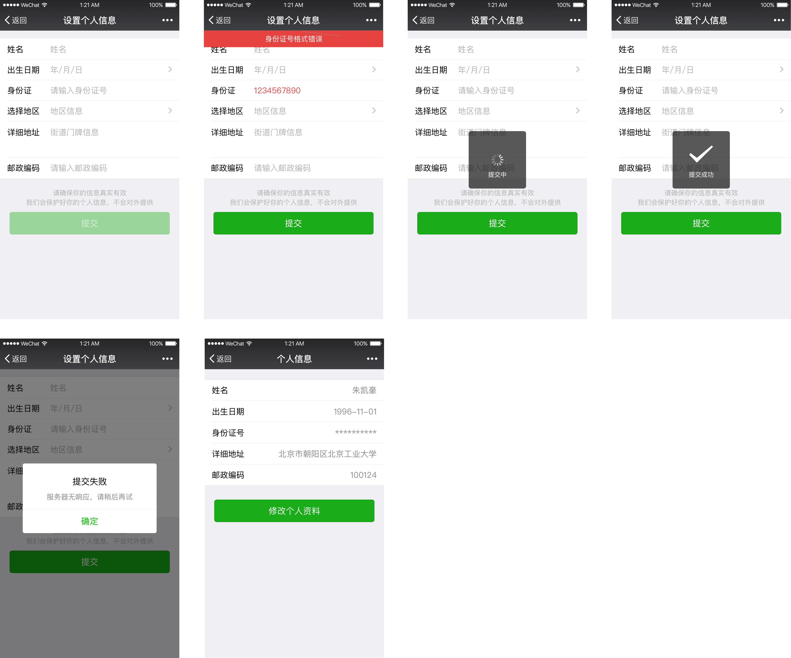

### 3.2 图书管理

#### 3.2.1 查看图书详细信息

##### 使用场景

微信小程序

##### 参与者

用户（读者）

##### 需求描述

* 用户能够查看书籍的详情，包括书籍的标题、出版社、版本号、封面、序、目录、内容简介、书评和导读、藏书量等信息。
* 系统应实时展示图书信息加载状态，加载失败时给出相应提示
* 用户能对图书进行不同操作：加入书单、查看书评、借阅图书

##### 软件原型

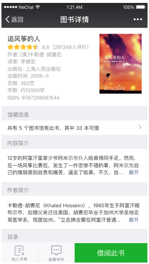

#### 3.2.2 分享图书

##### 使用场景

微信小程序

##### 参与者

用户（读者）

##### 需求描述

用户可点击小程序右上角分享按钮，将图书分享给好友，好友打开此消息即可查看图书详情。

### 3.3 搜索书籍

用户可以通过多种方式搜索书籍

#### 3.3.1 基于关键词的搜索

##### 使用场景

微信小程序

##### 参与者

用户（读者）

##### 需求描述

* 用户能够选择当前关键词的类别：图书标题、作者、isbn编号，输入关键词进行查询
* 用户可直接点击搜索历史记录或热门图书中的条目进行搜索，无须手动输入关键词
* 系统应实时展示搜索状态，搜索结果为空时或搜索失败时给出相应提示
* 系统应以列表的形式展示图书信息，包括：图书缩略图、标题、评分、作者、出版社、出版时间、藏书量
* 用户可点击搜索结果中的每一项，查看该图书的详细信息
* 搜索结果不为空时，用户可以上拉加载更多图书；当没有更多图书时，系统应给出相应提示

##### 软件原型

从左到右依次为：无搜索历史记录，有一条搜索历史记录，选择关键词类别，输入关键词

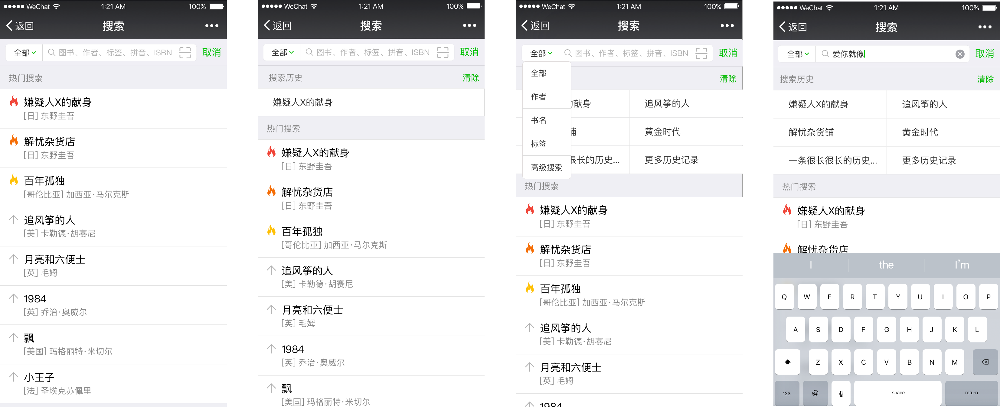

搜索状态

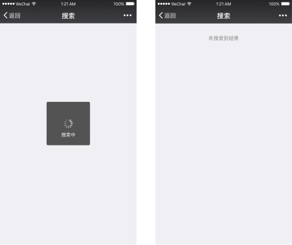

搜索结果与上拉加载
    
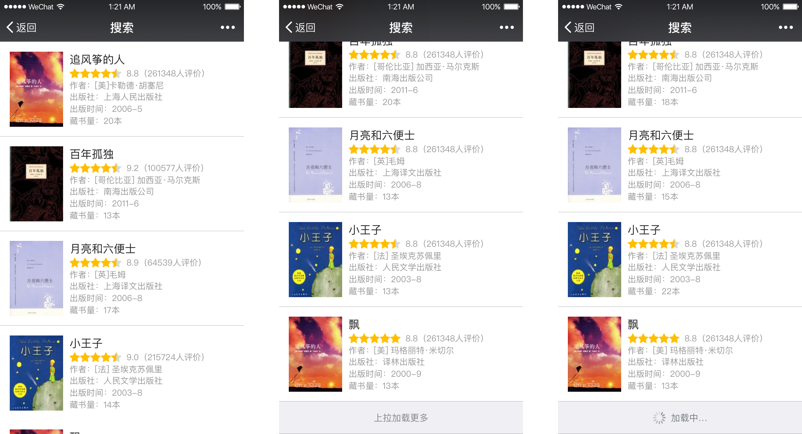

#### 3.3.2 基于微信扫码的搜索

##### 使用场景

微信小程序

##### 参与者

用户（读者）

##### 需求描述

* 用户能够通过微信的扫码功能扫描书籍的isbn编号直接获得该图书的详细信息
* 系统应检测用户扫码的类型，对不符合约定的类型给出相应提示信息
* 系统应实时展示扫码识别状态与识别结果，识别失败时给出相应提示信息

对于图书信息的需求，请见3.2.1

##### 软件原型

在搜索框的右侧有扫码图标，用户点击此图标即可进行扫码查询。

#### 3.3.3 基于学科分类的搜索

##### 使用场景

微信小程序

##### 参与者

用户（读者）

##### 需求描述

* 用户可依据学科分类进行精确查找
* 应用界面应提供列表形式的学科分类列表。当一个分类存在子分类时，点击该分类将进入该分类的子分类列表；当一个分类不存在子分类时，点击该分类将搜索该分类下的图书
* 由于学科分类较多，系统应一次只加载部分数据，用户可上拉加载更多数据；当没有更多分类时，系统应给出相应提示

对搜索结果的需求见3.3.1。

##### 软件原型
点击搜索框右侧”分类“图标即可进入分类检索页，点击分类即可进入它的子分类。

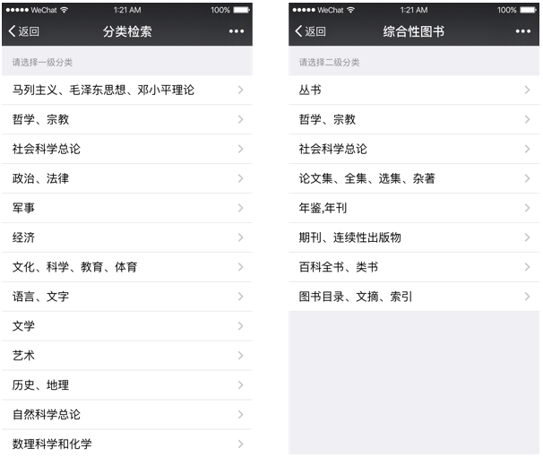

#### 3.3.4 基于多重搜索条件的搜索

##### 使用场景

微信小程序

##### 参与者

用户（读者）

##### 需求描述

* 用户可设置多个搜索条件进行高级搜索，进一步限制搜索结果的范围。搜索条件包括：图书名称、作者、出版社、出版日期范围
* 系统应检测表单数据格式，对错误内容格式给出相应提示
* 系统应实时展示表单提交状态，提交失败时给出相应提示

对搜索结果的需求见3.3.1。

##### 软件原型
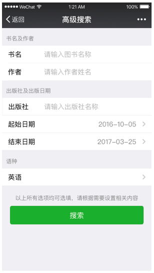

### 3.4 书单管理
用户可利用书单管理自己的阅读计划，用户也可收藏他人的书单。

#### 3.4.1 展示用户书单列表

##### 使用场景

微信小程序

##### 参与者

用户（读者）

##### 需求描述

* 系统应以列表展示用户的书单
* 系统应分类展示用户创建的书单与收藏的书单
* 用户可展开或折叠书单列表
* 用户可选择新建书单
* 当用户没有书单时，系统应给出相应提示信息
* 对于用户创建的书单，用户可编辑书单信息或删除书单；对于用户收藏的书单，用户可取消收藏书单
* 用户可点击书单内的每一项跳转至书单详细信息
* 当用户进入书单页时，系统应在后台自动加载并更新用户书单列表；加载失败时，系统应给出相应错误提示信息

##### 软件原型
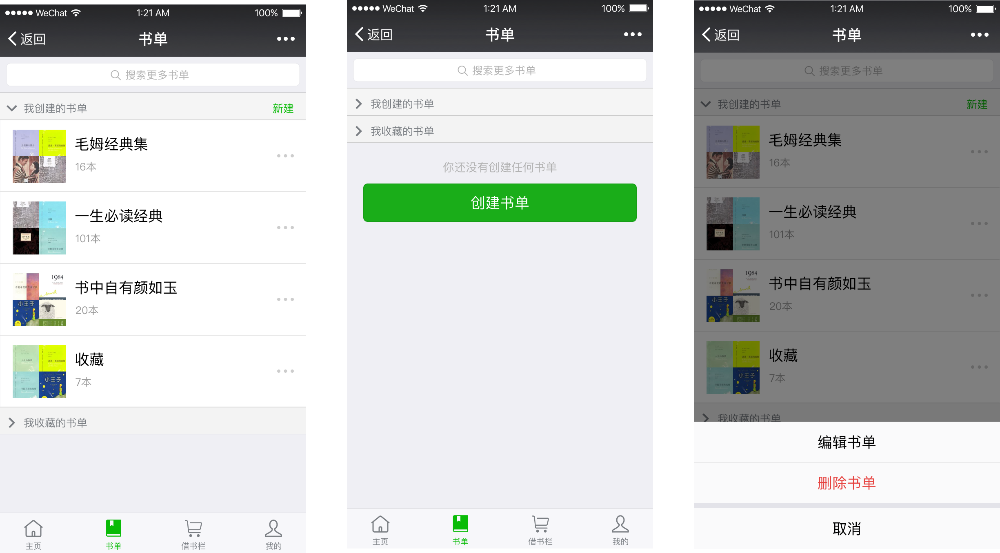

#### 3.4.2 创建书单/修改书单信息

##### 使用场景

微信小程序

##### 参与者

用户（读者）

##### 需求描述

* 用户可创建书单，设置书单标题与描述，标题为必填项，描述为可选项
* 用户可修改书单标题或描述
* 书单描述不得超过150个字
* 系统应检测表单内容，对异常内容给出相应提示
* 系统应实时展示表单提交状态，提交失败时给出相应提示

#### 3.4.3 将图书加入书单

##### 使用场景

微信小程序

##### 参与者

用户（读者）

##### 需求描述

* 当用户查看图书详情时，用户可选择将该图书加入自己创建的书单
* 用户可选择加入哪个书单；若用户没有创建书单，系统需引导用户创建第一个书单
* 用户可为书单中的图书设置个性化的描述（如：为什么要收藏这本书）

##### 软件原型
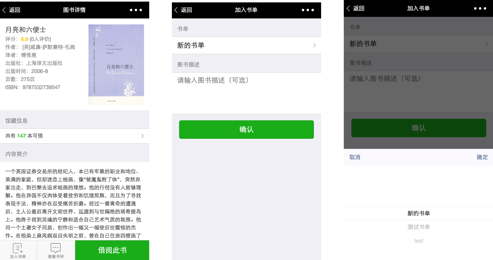

#### 3.4.4 查看书单详细信息

##### 使用场景

微信小程序

##### 参与者

用户（读者）

##### 需求描述

* 用户可查看书单详细信息，包括：创建者、创建时间及包含图书
* 系统应以列表的形式展示书单内的书籍信息，书籍信息包括：图书缩略图、标题、评分、作者、出版社、出版日期、ISBN、以及书单创建者为图书添加的个性化描述
* 由于书单描述内容较多，因此默认隐藏，用户可展开书单描述
* 由于书单内图书较多，系统应一次加载部分图书，用户可上拉加载更多图书；当没有更多图书时，系统应给出相应提示
* 如果用户是此书单的创建者，则显示编辑按钮，否则显示收藏按钮，用户可选择编辑或收藏/取消收藏此书单
* 系统应实时展示书单信息加载状态及图书加载状态，加载失败时给出相应提示
* 当用户选择收藏或取消收藏书单时，系统应实时展示加载状态及操作结果

##### 软件原型

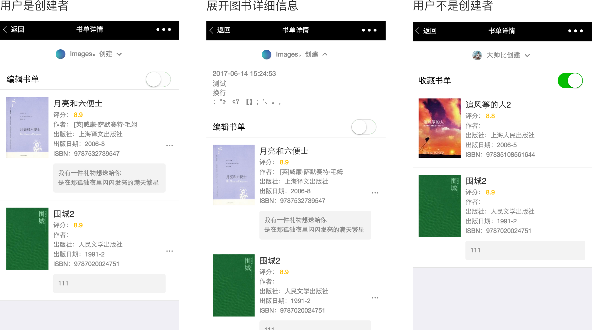

#### 3.4.5 修改书单内图书信息

##### 使用场景

微信小程序

##### 参与者

用户（读者）

##### 需求描述

用户可以对自己创建的书单进行修改：

* 用户可设置书单内每本图书的个性化描述
* 用户可切换书单的编辑状态，当用户打开编辑模式时，用户可批量删除书单内的图书
* 系统应实时展示表单提交状态，在提交成功或失败时分别给出相应的提示

##### 软件原型

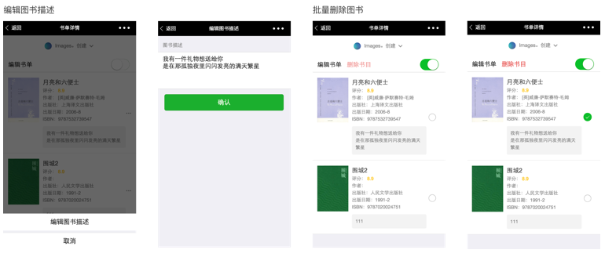

#### 3.4.6 分享书单

##### 使用场景

微信小程序

##### 参与者

用户（读者）

##### 需求描述

用户可点击小程序右上角分享按钮，将书单分享给好友，好友打开此消息即可查看书单详情。

### 3.5 书评管理

#### 3.5.1 查看某本图书的书评

##### 使用场景

微信小程序

##### 参与者

用户（读者）

##### 需求描述

* 用户可在图书详情页中浏览该图书的书评
* 系统应以列表的形式展示书评信息，包括：用户头像、用户昵称、发表时间、评分及书评内容
* 对于用户自己的书评，应显示“删除”按钮
* 系统应一次加载部分书评，用户可上拉加载更多书评；当没有更多书评时，系统应给出相应提示
* 系统应实时展示书评加载状态，加载失败时给出相应提示

##### 软件原型

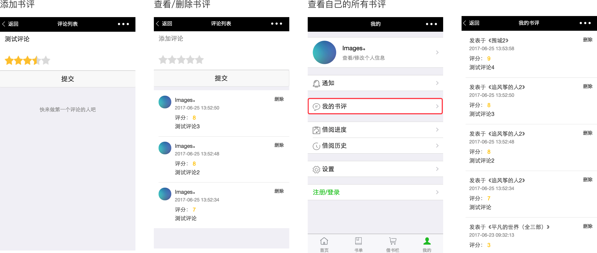

#### 3.5.2 查看自己的所有书评

##### 使用场景

微信小程序

##### 参与者

用户（读者）

##### 需求描述

* 用户可在个人中心查看自己发表的所有书评
* 系统应以列表的形式展示书评信息，包括：书评所在图书标题、发表时间、评分及书评内容
* 每个书评有对应的“删除”按钮
* 系统应一次加载部分书评，用户可上拉加载更多书评；当没有更多书评时，系统应给出相应提示
* 系统应实时展示书评加载状态，加载失败时给出相应提示

##### 软件原型

见3.5.1

#### 3.5.3 增加书评

##### 使用场景

微信小程序

##### 参与者

用户（读者）

##### 需求描述

* 用户可以为图书添加书评及评分，书评内容及评分均不能为空
* 系统应对表单内容进行检测，检测错误时给出相应提示
* 系统应实时展示表单提交状态，表单提交成功或失败时给出相应提示

##### 软件原型

见3.5.1

#### 3.5.4 删除书评

##### 使用场景

微信小程序

##### 参与者

用户（读者）

##### 需求描述

* 用户可以删除自己的书评
* 系统应实时展示书评删除状态，删除成功或失败时给出相应提示

##### 软件原型
见3.5.1

### 3.6 推荐阅读

系统可为用户进行多方位的推荐，推荐内容包括书籍与书单。

#### 3.6.1 相关图书推荐

##### 使用场景

微信小程序

##### 参与者

用户（读者）

##### 需求描述

* 用户在查看一本书的时候，系统可以向用户推荐其它相关书籍给用户
* 系统应以水平列表的方式展示相关书籍信息，包括：图书缩略图、作者
* 用户可点击图书图片，跳转至该图书的图书详情页

##### 软件原型

#### 3.6.2 推荐图书

##### 使用场景

微信小程序

##### 参与者

用户（读者）

##### 需求描述

* 系统可以根据用户的长期的阅读及一段时间的多次搜索习惯给用户量身定制，定期给用户推荐书籍
* 系统应以水平列表的方式展示推荐书籍基础信息，包括：图书缩略图、作者
* 用户可以竖直列表的形式查看推荐图书的简要信息，包括：图书缩略图、标题、评分、作者、出版社、推荐理由
* 用户可点击水平列表中的图书图片或竖直列表中的图书卡片，跳转至图书的详细信息

##### 软件原型

用户点击“推荐图书”标题，可跳转至列表页；点击图书图片，可进入图书详情。

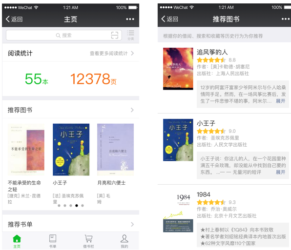

#### 3.6.3 推荐书单

##### 使用场景

微信小程序

##### 参与者

用户（读者）

##### 需求描述

* 系统可根据用户收藏的书籍，定期为用户推荐书单
* 系统应以水平列表的方式展示推荐书单的信息，包括：书单缩略图、书单标题
* 用户可按竖直列表的形式查看推荐书单的简要信息，包括：书单缩略图、书单标题、创建者、收藏人数
* 用户可点击水平列表或竖直列表中的书单，跳转至该书单的详细信息

##### 软件原型
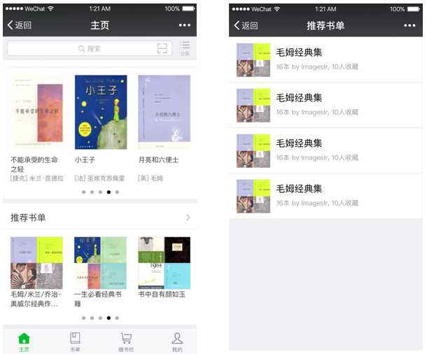

#### 3.6.4 近期热门图书

##### 使用场景

微信小程序

##### 参与者

用户（读者）

##### 需求描述

* 系统应根据近期的借阅记录与搜索记录，统计出近一周的热门图书
* 系统应以水平列表的方式展示热门图书的基础信息，包括：图书缩略图、作者
* 用户可按竖直列表的形式查看热门图书的简要信息，包括：图书缩略图、标题、评分、作者、出版社、推荐理由
* 用户可点击水平列表中的图书图片或竖直列表中的图书卡片，跳转至图书的详细信息

##### 软件原型

见3.6.2，将”推荐图书“替换为”近期热门图书“

### 3.7 借阅书籍

用户可基于系统完成整个借书流程，主要分为：在线预订或现场借书、押金提交、取书、还书。

#### 3.7.1 在线查看图书馆藏

##### 使用场景

微信小程序

##### 参与者

用户（读者）

##### 需求描述

* 用户可在图书详情内查看该图书的总馆藏数量
* 系统应以列表的形式展示各图书馆中该图书的馆藏信息，包括：图书馆名称、地址、总馆藏数量、可借数量
* 用户可选择一个图书馆预订此图书

##### 软件原型

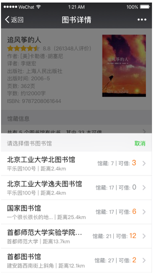

#### 3.7.2 在线预订/预约图书

##### 使用场景

微信小程序

##### 参与者

用户（读者）

##### 需求描述

* 注册用户可以在线预订书籍，并指定具体时间去图书馆取书
* 如果不巧暂时没有藏书，用户可以选择当有用户归还书籍后系统自动给他推送信息提醒
* 系统应实时展示订单提交状态，提交失败时给出相应提示
* 系统应记录用户的订单信息，并为每个订单生成一个唯一的订单号
* 订单提交成功后，系统应为用户展示订单简要信息：取书时间、取书地点

##### 软件原型

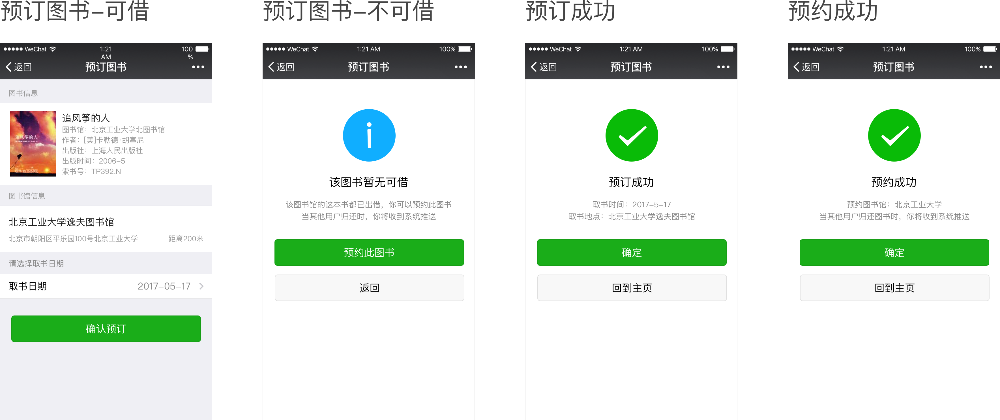

#### 3.7.3 现场借书

##### 使用场景

微信小程序

##### 参与者

用户（读者）

##### 需求描述

* 用户可直接在图书馆进行借书，图书上贴有二维码，用户在图书馆可以使用应用的扫码功能将书放入借书栏
* 扫码成功后，系统应根据二维码内容获取图书信息，并将图书简要形式展示在借书栏，包括：标题、作者、出版社、出版时间、索书号
* 用户可删除借书栏中的图书
* 一个用户一次可借2本书
* 系统应根据借书栏内容生成借书二维码。用户向图书馆管理员出示自己的借书二维码后，管理员通过自己的管理app的扫码功能扫描用户出示的二维码调出用户的借书单，与实物进行比较，并检查用户押金状态，确认无误后提交订单，订单创建成功后用户方可取书
* 系统应记录用户的订单信息，并为每个订单生成一个唯一的订单号
* 系统应提供借书步骤的相关说明
* 系统应实时展示扫码状态与结果，对非法扫码及扫码失败应给出响应提示
* 系统应实时展示图书内容加载状态，加载失败时给出相应提示
* 系统应实时展示表单提交状态，提交失败时给出相应提示

##### 软件原型

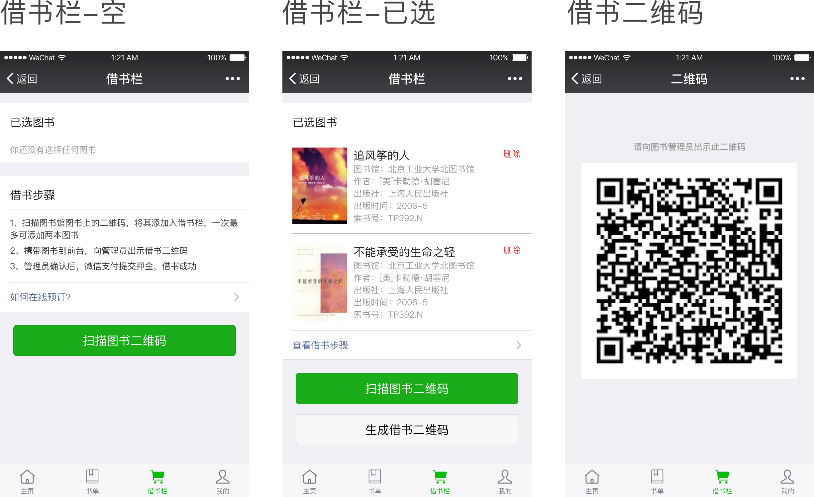

#### 3.7.4 押金提交

##### 使用场景

微信小程序

##### 参与者

用户（读者）

##### 需求描述

* 用户需要提交押金后才可享受借书服务
* 用户通过微信支付手段的方式提交押金，提交后可查看自己的押金状态
* 图书馆管理员也可查看用户的押金提交状态，并为已提交押金的用户办理借书业务
* 用户仅需提交一次押金，便可在所有已注册图书馆中借书
* 用户可选择退还押金

##### 软件原型
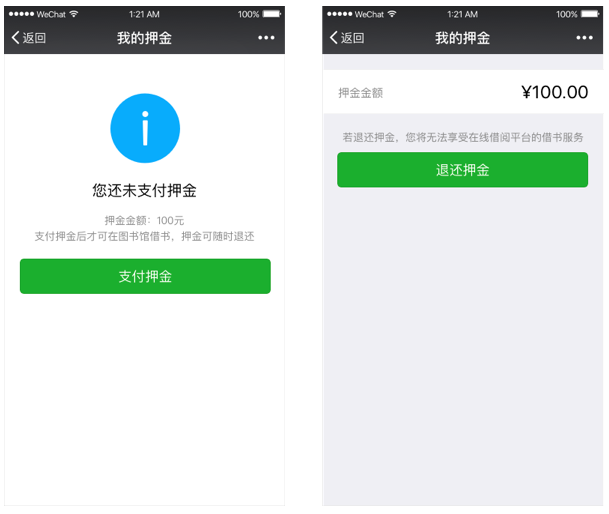

#### 3.7.5 还书

##### 使用场景

微信小程序

##### 参与者

用户（读者）

##### 需求描述

* 用户可查看自己的订单号
* 用户携带书籍去图书馆，出示自己的订单号给管理，管理员通过管理app输入订单号获取到订单的详细信息，与实物比较无误后办理书籍入库，完成还书环节

##### 软件原型

订单详情见3.8.2

### 3.8 订单管理

#### 3.8.1 分类查看订单

##### 使用场景

微信小程序

##### 参与者

用户（读者）

##### 需求描述

* 用户可分类查看自己的订单，分为预约中、借阅中、已完成
* 系统以列表的形式展示订单简要信息，包括：图书缩略图、标题、作者、出版社、借书图书馆、预约日期、借阅日期、应还日期、还书日期、订单状态
* 用户可点击列表中的订单，跳转到订单的详细信息
* 对于未取书订单，用户可选择取消订单，取消时需要用户进行二次确认
* 系统应实时展示订单列表加载状态，加载失败时给出相应提示

##### 软件原型
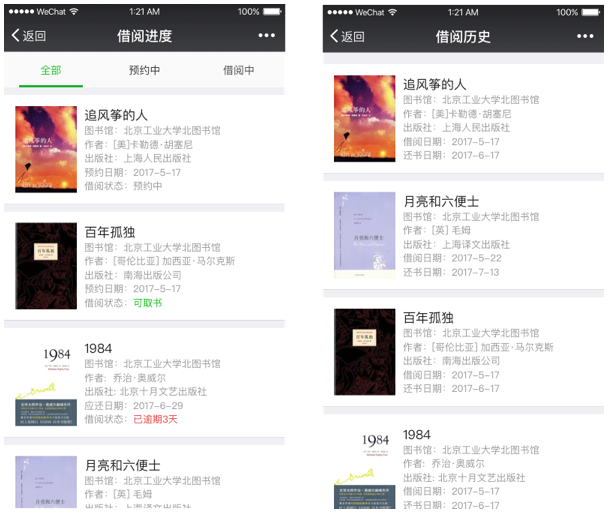

#### 3.8.2 查看订单详情

##### 使用场景

微信小程序

##### 参与者

用户（读者）

##### 需求描述

* 用户可查看订单的详细信息，包括：订单信息、图书信息、图书馆信息、订单相关操作
* 订单信息包括：订单状态、预约日期、借阅日期、应还日期、还书日期、剩余续借次数
* 图书信息包括：图书缩略图、标题、作者、出版社
* 图书馆信息包括：图书馆名称、图书馆地址
* 订单相关操作包括：续借图书、取消订单
* 系统应实时展示订单详细信息加载状态，加载失败时给出相应提示

##### 软件原型
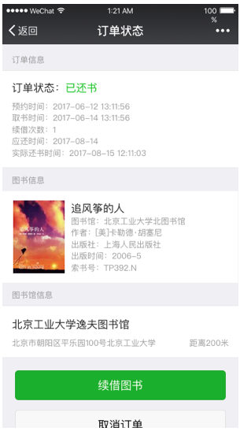

#### 3.8.3 取消订单

##### 使用场景

微信小程序

##### 参与者

用户（读者）

##### 需求描述

* 对于未取书的订单，用户可通过小程序取消订单
* 系统应实时展示取消订单表单提交状态，取消订单成功或失败时给出相应提示

##### 软件原型
用户可点击订单列表中右上角的“取消”按钮，也可进入订单详情，选择“取消订单”

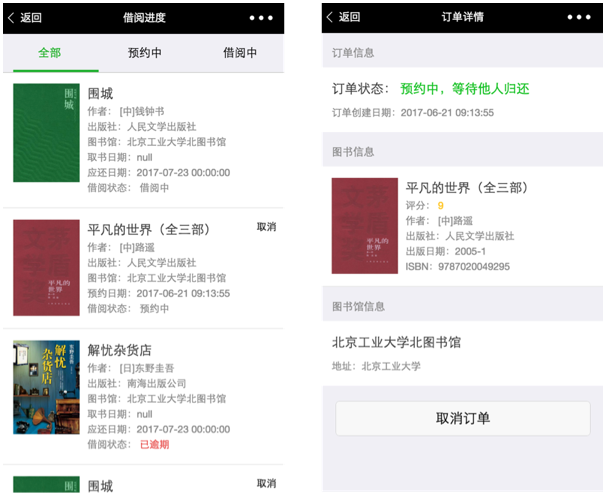

#### 3.8.4 图书续借

##### 使用场景

微信小程序

##### 参与者

用户（读者）

##### 需求描述

* 每本图书可续借一次，用户可在还书日期前通过小程序续借图书，续借后还书日期延长一个月
* 系统应实时展示续借图书表单提交状态，续借成功或失败时给出相应提示

##### 软件原型
见3.8.2

### 3.9 通知提醒

#### 3.9.1 取书通知

##### 使用场景

微信小程序

##### 参与者

用户（读者）

##### 需求描述

当用户预约了一本暂无可借的书籍时，系统会在其他用户归还书籍后自动给他发送通知，通知内容包括：图书名称、取书地点。

##### 软件原型
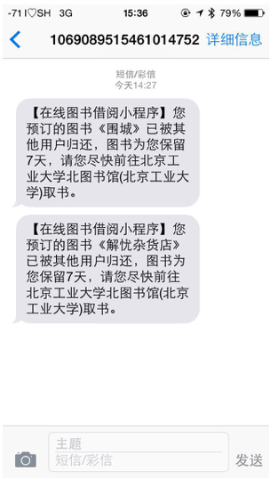

#### 3.9.2 还书通知

##### 使用场景

微信小程序

##### 参与者

用户（读者）

##### 需求描述

一本书借出去有还书的提醒，系统从倒计时1周开始给用户发送通知，通知内容包括：图书名称、剩余还书时间。

##### 软件原型
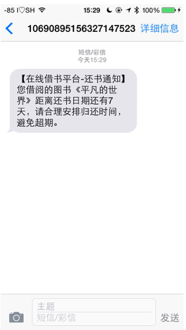

#### 3.9.3 逾期还书通知

##### 使用场景

微信小程序

##### 参与者

用户（读者）

##### 需求描述

当一本图书逾期仍未归还时，系统会给用户发送通知。

##### 软件原型
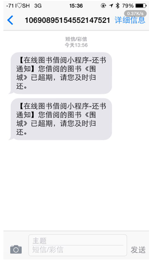

### 3.10 图书馆管理
#### 3.10.1 图书馆登录

##### 使用场景

桌面端管理应用/安卓端管理员app

##### 参与者

图书馆管理员

##### 需求描述

* 图书馆管理员在桌面端管理应用/安卓端管理员app中登录后才能进行管理员相关操作，登录信息包括：账户名、密码
* 系统应检测登录表单数据格式，对错误内容给出相应提示
* 系统应实时展示登录状态，登录失败时给出相应提示

##### 软件原型

桌面端登录页面

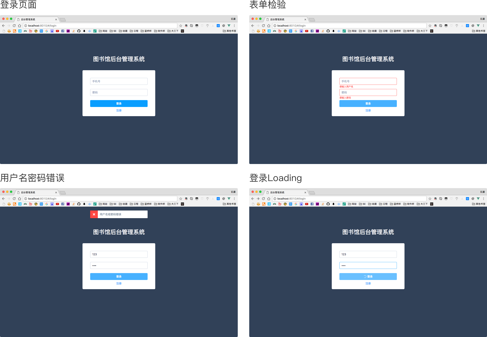

安卓端登录页面

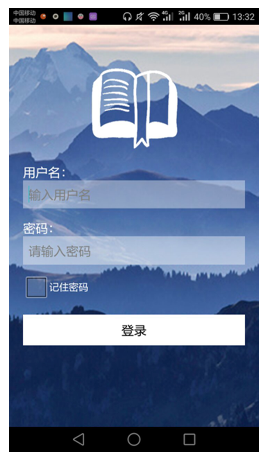

#### 3.10.2 图书馆注册

##### 使用场景

桌面端管理应用

##### 参与者

图书馆管理员

##### 需求描述

* 图书馆管理员可在桌面端管理应用注册，注册信息包括：负责人手机号、负责人姓名、密码、图书馆名称、图书馆地址、图书馆电话、图书馆描述
* 系统应检测表单数据格式，对错误内容给出相应提示
* 系统应实时展示注册状态，注册成功或失败时给出相应提示

##### 软件原型
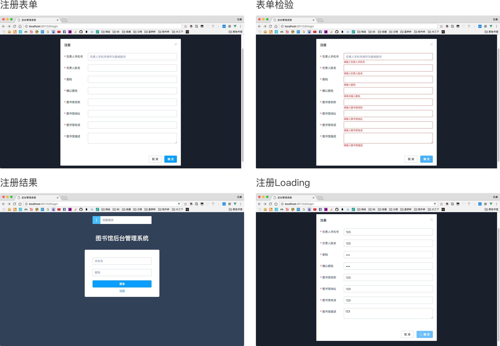

#### 3.10.3 查看/修改图书馆信息

##### 使用场景

桌面端管理应用

##### 参与者

图书馆管理员

##### 需求描述

* 图书馆管理员可在桌面端管理应用查看图书馆基本信息，包括：近期借阅信息（近7天每天的图书借阅数量）与图书馆基本信息（负责人手机号、负责人姓名、图书馆名称、图书馆地址、图书馆电话、图书馆描述）
* 图书馆管理员可修改图书馆基本信息
* 系统应检测表单数据格式，对错误内容给出相应提示
* 系统应实时展示表单提交状态，修改成功或失败时给出相应提示

##### 软件原型

查看图书馆信息

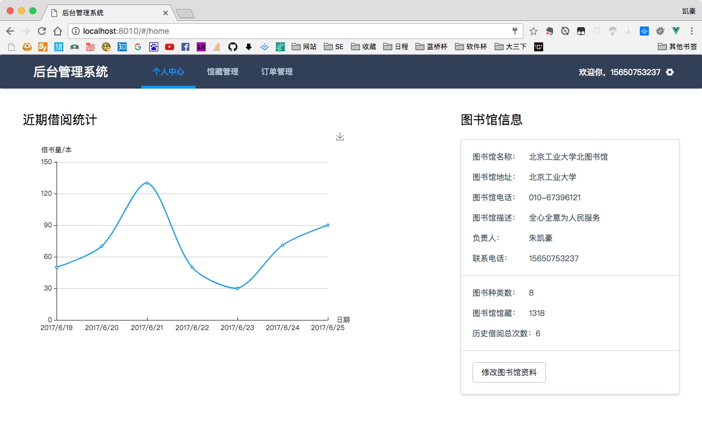

修改图书馆信息

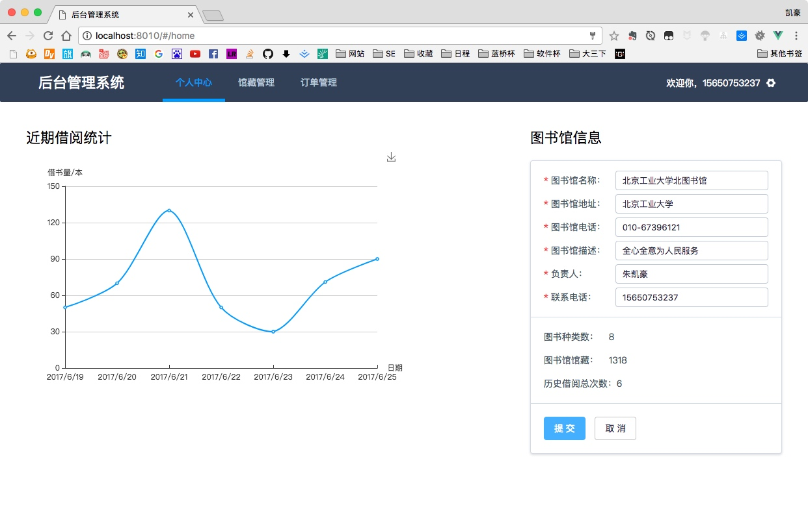

### 3.11 图书馆馆藏管理
#### 3.11.1 查看/搜索图书馆馆藏信息

##### 使用场景

桌面端管理应用

##### 参与者

图书馆管理员

##### 需求描述

* 图书馆管理员可在桌面端管理应用查看图书馆馆藏信息，系统应以列表的方式展示馆藏信息，包括：图书标题、isbn、总数、可借数
* 系统应提供分页浏览图书馆藏的功能
* 图书馆管理员可根据图书isbn搜索本馆该书的馆藏信息
* 系统应实时展示馆藏信息加载状态，暂无结果或加载失败时给出相应提示

##### 软件原型

查看图书馆藏

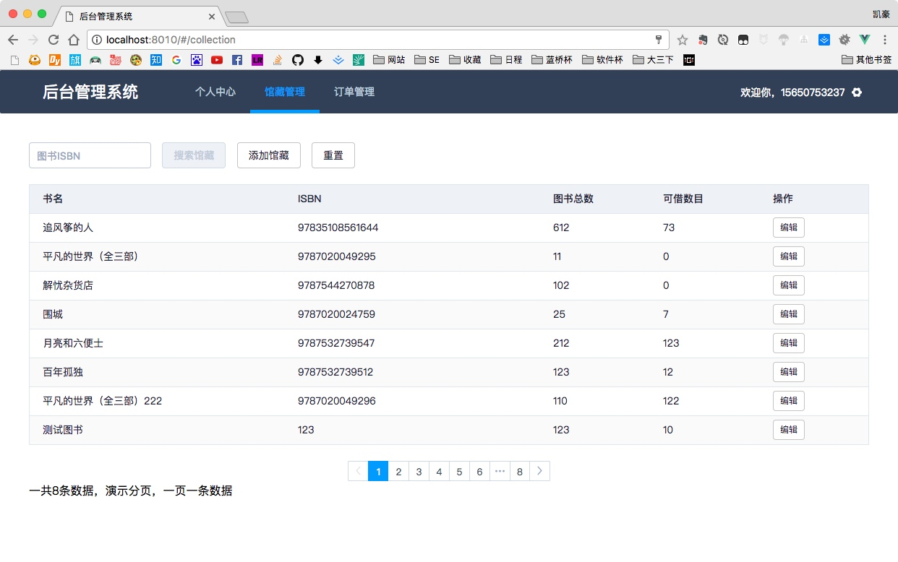

搜索图书馆藏

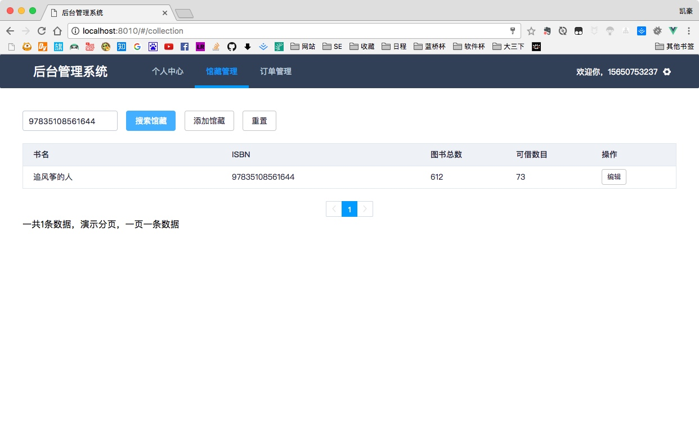

无结果

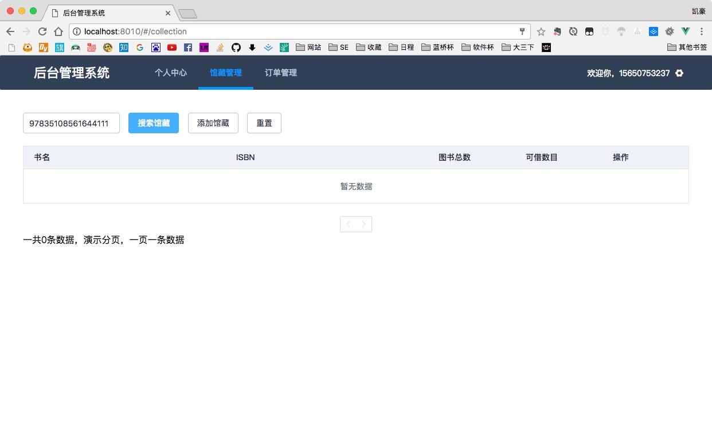

#### 3.11.2 添加/修改图书馆馆藏信息

##### 使用场景

桌面端管理应用

##### 参与者

图书馆管理员

##### 需求描述

* 图书馆管理员可在桌面端管理应用修改或新增本馆该书的馆藏信息，管理员需要提交的信息为：图书isbn、图书总数、图书可借数
* 若该图书的馆藏信息已存在，则系统应更新其馆藏信息；若该图书的馆藏信息不存在，则系统应为其创建一条馆藏记录
* 系统应实时展示馆藏信息更新状态，更新成功或失败时给出相应提示

##### 软件原型
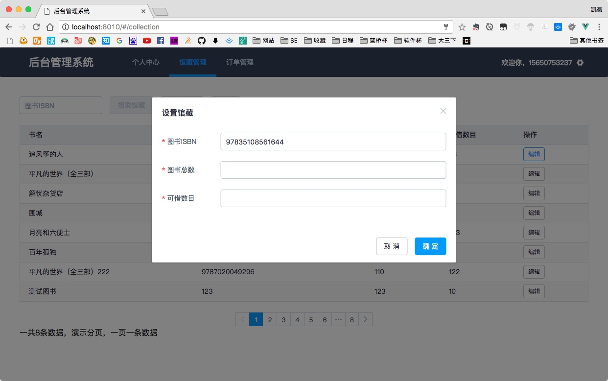

### 3.12 借阅流程

#### 3.12.1 取书

##### 使用场景

安卓端管理员app

##### 参与者

图书馆管理员

##### 需求描述

* 用户在线预订图书后会生成一个订单，用户将在约定日期前往图书馆取书
* 用户向图书馆管理员展示订单，图书馆管理员在管理员app中输入订单号，可获取到用户的个人信息与该订单所预订的图书信息
* 管理员检查用户信息无误后，点击“确认取书”，系统将修改订单状态，完成取书
* 订单不存在或发生错误时，应提示错误信息

#### 3.12.2 线下借书

##### 使用场景

安卓端管理员app

##### 参与者

图书馆管理员

##### 需求描述

* 用户可在图书馆内选择要借的图书，将图书加入借书栏后生成二维码
* 用户向图书馆管理员展示借书二维码，图书馆管理员在管理员app中点击借书，扫描用户借书二维码，系统展示用户的个人信息与该借书二维码中包含的图书信息
* 管理员检查用户信息并核对图书，无误后，点击确认，系统将创建订单
* 发生错误时，应提示错误信息

#### 3.12.3 还书

##### 使用场景

安卓端管理员app

##### 参与者

图书馆管理员

##### 需求描述

* 用户可前往图书馆还书
* 用户向图书馆管理员展示个人二维码，图书馆管理员在管理员app中点击还书，扫描用户二维码，系统展示用户的个人信息
* 管理员继续扫描用户归还的图书的isbn条形码，以列表形式展示订单信息
* 管理员可连续添加多本图书到待归还列表
* 确认无误后，管理员点击确认还书，系统修改订单状态，完成还书
* 发生错误时，应提示错误信息

### 3.13 图书馆订单管理

#### 3.13.1 查看图书馆订单

##### 使用场景

桌面端管理应用

##### 参与者

图书馆管理员

##### 需求描述

* 图书馆管理员可在桌面端管理应用查看其所在图书馆的订单，系统应以列表的形式展示订单的简要信息，包括：订单id、借阅人、手机号、书名、isbn、订单状态
* 管理员可选择一个订单，查看其详细信息，包括：订单预约日期、借阅日期、应还日期、还书日期、剩余续借次数
* 系统应提供分页浏览订单的功能
* 系统应实时展示订单列表加载状态，暂无结果或加载失败时给出相应提示

#### 3.13.2 搜索订单

##### 使用场景

桌面端管理应用

##### 参与者

图书馆管理员

##### 需求描述

* 图书馆管理员可在桌面端管理应用搜索本图书馆的订单。系统应提供多种搜索条件的组合搜索，包括：手机号、创建日期、结束日期、订单状态
* 订单状态包括：预约中、可取书、借阅中、已逾期、已归还
* 系统应提供分页浏览订单的功能
* 系统应实时展示订单列表搜索状态，搜索不到结果或搜索失败时给出相应提示

#### 3.13.3 修改订单

##### 使用场景

桌面端管理应用

##### 参与者

图书馆管理员

##### 需求描述

* 图书馆管理员可在桌面端管理应用修改某个订单的状态或删除订单
* 删除订单需要用户进行二次确认
* 系统应实时展示表单提交状态，修改订单失败时给出相应提示

## 4. 非功能性需求
所有界面元素，都应遵循WeUI设计规范与Element设计规范，要求简洁，大方，美观，用户体验良好。

### 4.1 WeUI设计规范

WeUI设计规范用于指导小程序的界面开发。

#### 4.1.1 基本设计原则

##### 友好礼貌
为了避免用户在微信中使用小程序服务时，注意力被周围复杂环境干扰，小程序在设计时应该注意减少无关的设计元素对用户目标的干扰，礼貌地向用户展示程序提供的服务，友好地引导用户进行操作。

##### 重点突出
每个页面都应有明确的重点，以便于用户每进入一个新页面的时候都能快速地理解页面内容。在确定了重点的前提下，应尽量避免页面上出现其它与用户的决策和操作无关的干扰因素。

##### 流程明确
为了让用户顺畅地使用页面，在用户进行某一个操作流程时，应避免出现用户目标流程之外的内容而打断用户。

##### 清晰明确
一旦用户进入我们的小程序页面，我们就有责任和义务清晰明确地告知用户身在何处、又可以往何处去，确保用户在页面中游刃有余地穿梭而不迷路，这样才能为用户提供安全且愉悦的使用体验。小程序导航栏支持基本的背景颜色自定义功能，选择的颜色需要在满足可用性前提下，和谐搭配微信提供的两套主导航栏图标，让用户能够明确定位当前位置信息并选择相应操作。

##### 层级清晰

小程序支持底部tab栏、页面标签栏、页面跳转。为保证用户良好的使用体验，tab栏不得超过5个；标签数量不得少于2个，最多不得超过5个，为确保点击区域，建议标签数量不超过4项。一个页面也不应出现一组以上的标签分页栏；页面层级最多为5层。

##### 减少等待，反馈及时
页面的过长时间的等待会引起用户的不良情绪，当不可避免的出现了加载和等待的时候，需要予以及时的反馈以舒缓用户等待的不良情绪。对于加载情况与成功情况，显示一个Toast告知用户相关信息，不打断用户操作。

##### 异常可控，有路可退
在设计任何的任务和流程时，异常状态和流程往往容易被忽略，而这些异常场景往往是用户最为沮丧和需要帮助的时候，因此需要格外注意异常状态的设计，在出现异常时予以用户必要的状态提示，并告知解决方案，使其有路可退。

要杜绝异常状态下，用户莫名其妙又无处可去，停滞在某一个页面的情况。当程序发生不可接受的错误时，需要通过模态对话框或结果页面向用户提醒结果。这会打断用户操作，使其针对异常情况作出必要决策。

除此之外，在表单页面中尤其是表单项较多的页面中，还应明确指出出错项目，以便用户修改。

##### 便捷优雅
从PC时代的物理键盘鼠标到移动端时代手指，虽然输入设备极大精简，但是手指操作的准确性却大大不如键盘鼠标精确。为了适应这个变化，需要开发者在设计过程中充分利用手机特性，让用户便捷优雅的操控界面。

#### 4.1.2 视觉规范

##### 字体规范

* 需要着重突出的数字信息，字号为40pt，如：图书馆馆藏信息中的可借数目
* 页面大标题，字号为20pt
* 页面大按钮字体，字号为18pt
* 页面首要层级信息，字号为17pt，如：图书标题
* 页面次要描述信息，服务于首要层级信息，字号为14pt，如：图书简介
* 页面辅助信息，需要弱化的内容，字号为13pt，如：底部版权信息

##### 色彩规范

* 正黑色，#353535，如：页面主内容
* 绿色，#09BB07，与微信官方色系相同，如：主要按钮，完成信息
* 蓝色，#576B95，如：链接
* 红色，#E64340，如：错误提示信息
* 灰色，#888888，如：表单标签

##### 列表视觉规范

* 列表间距：20px
* 列表项间距：15px
* 列表项标签与列表项表单间距：8px
* 列表提交按钮与列表间距：40px
* 列表提交按钮说明文字与按钮间距：20px，上方
* 展示信息的容器应有适当内补：15px

##### 按钮使用原则

绿色按钮为主要按钮，鼓励用户操作；灰色按钮为默认按钮。

在需要鼓励用户进行某种操作的情况下，采用绿色按钮；在需要用户自我选择的情况下，均采用灰色按钮，不应替用户做出选择。

### 4.2 Element设计规范

#### 4.2.1 基本规范

##### 一致性 Consistency

与现实生活一致：与现实生活的流程、逻辑保持一致，遵循用户习惯的语言和概念；

在界面中一致：所有的元素和结构需保持一致，比如：设计样式、图标和文本、元素的位置等。

##### 反馈 Feedback

控制反馈：通过界面样式和交互动效让用户可以清晰的感知自己的操作；

页面反馈：操作后，通过页面元素的变化清晰地展现当前状态。

##### 效率 Efficiency

简化流程：设计简洁直观的操作流程；

清晰明确：语言表达清晰且表意明确，让用户快速理解进而作出决策；

帮助用户识别：界面简单直白，让用户快速识别而非回忆，减少用户记忆负担。

##### 可控 Controllability

用户决策：根据场景可给予用户操作建议或安全提示，但不能代替用户进行决策；

结果可控：用户可以自由的进行操作，包括撤销、回退和终止当前操作等。

#### 4.2.2 视觉规范

* 主色：#20A0FF，鲜艳、友好的蓝色
* 辅助色：除了主色外的场景色，需要在不同的场景中使用（例如危险色表示危险的操作）
  * 成功色：绿色，#13CE66
  * 警告色：橙色，#F7BA2A
  * 危险色：红色，#FF4949
* 中性色：#324057，用于文本、背景和边框颜色。通过运用不同的中性色，来表现层次结构。

